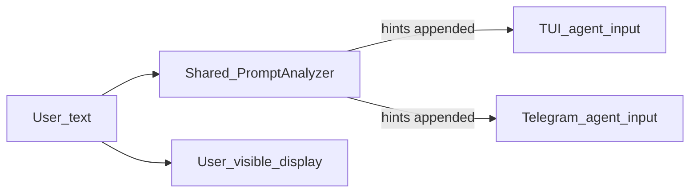

# ADR 0001 — PromptAnalyzer shared parity

- **Status:** Accepted
- **Cluster:** A — PromptAnalyzer (umbrella **Phase 1**)
- **Date:** 2026-07-12
- **Umbrella:** [src/docs/reference/plans/plan-mode/umbrella.md](umbrella.md)
- **Related spec note:** [src/docs/reference/plans/plan-mode/json-spec.md](json-spec.md) soft-nudge paragraph under User language → mode
- **Sibling ADRs:** [README.md](README.md); design-track hint swap lands in [0004-plan-mode-ux.md](0004-plan-mode-ux.md) (Cluster D / Phase 6)

## Context

The TUI prompt analyzer injects tool-usage hints when user text matches keyword lists. Those hints are meant to steer the model toward the right tools. Today the plan-keyword CRITICAL block still teaches dead operations (`create`, `finalize`) while the live `plan` tool and [src/brain/prompt_builder.rs](../../../../brain/prompt_builder.rs) only support `init`, `add_task` (alias during rollout), `start`, and `complete`. Soft-nudge that still mentions dead ops is how models learn to call tools that do not exist.

Telegram never runs the analyzer at all. The two surfaces therefore disagree about soft-nudge behavior: TUI users get keyword families (plan, read, grep, write, edit, bash, web_search); Telegram users get none of them. That gap is a product parity bug, not a deliberate Telegram design.

Skill and user-command expansions can rewrite the agent string to skill-body or `SKILL.md` prose that still contains trigger words. Matching those expansions falsely fires soft-nudge. Soft-nudge is supposed to mean the *user* said plan-shaped (or other keyword) language, not that a skill author wrote the word “plan” or “find” in a body.

Earlier drafts kept soft-nudge TUI-only. The grill on 2026-07-12 reversed that: extract the full analyzer to a shared module and run it on both TUI and Telegram. An accidental standalone “Prompt Analyzer Shared Parity” plan was merged into the umbrella and deleted; this ADR is the execution slice for that locked decision.

This cluster fixes dead hints and surface parity without waiting for Plan mode lifecycle, Approve, flow-message redesign, or design-track soft-nudge. Phase 1 has **no functional dependency** on Phase 2 (Cluster B) or on the Editing/Active lifecycle (Cluster C). Preferred ship order in the umbrella diagram is soft-nudge before UX polish; that is preference only.

## Decision

Extract the full `PromptAnalyzer` into [src/utils/prompt_analyzer.rs](../../../../utils/prompt_analyzer.rs) and run it on **both** TUI and Telegram for natural-language chat only. Scope is the **full** analyzer — every keyword family that exists today — not a plan-only subset.

Replace the plan CRITICAL block so it teaches today’s live tool contract: `init` → `add_task` → `start`, and explicitly rejects `create` / `finalize`, matching the preamble. Keep keyword lists unchanged, including bare `"find"` in the search family. OC Dev review correctly noted that dead-op risk lives in **injected hint text**, not in the trigger keywords themselves; fix the strings in Phase 1 rather than retuning lists.

Hints are **LLM-only**. Append them only to the agent string. Never mutate Telegram `display_text` or TUI chat bubbles.

Skip slash and skill expansions on both surfaces. Do not invent Telegram-only skip logic that the TUI does not share in spirit.

Accept that until Cluster D / Phase 6 swaps the plan hint, utterances like “make a plan…” still receive **checklist-shaped** live-ops hints (`init` / `add_task` / `start`) rather than design-track (`init mode=design`, write SESSION PLAN `.md`, wait for Approve). That interim window is intentional: it removes dead ops immediately. **This cluster may ship to Telegram without Cluster D / Phase 6 in the same release** (locked — grill 2026-07-12). Do not “fix” the hint back to design-track early outside Phase 6 / ADR 0004.

Soft-nudge complements Telegram `/plan` and flow chrome; the analyzer does not replace them. Soft-nudge also does not replace brain preamble A3 for execute-shaped work that never says “plan.”

## Considered options

| Option | Outcome |
|---|---|
| Keep soft-nudge TUI-only | Rejected by grill 2026-07-12 — leaves Telegram without keyword-hint parity |
| Fix TUI plan hints only (no extract, no Telegram wire) | Leaves Telegram without soft-nudge; keeps analyzer buried under `tui/` |
| Wait for design-track `mode=design` / Phase 6 before fixing hints | Leaves dead `create` / `finalize` in production longer |
| Ship plan-family only on Telegram; keep other families TUI-only | Rejected — locked scope is the **full** analyzer on both surfaces |
| Drop or tighten bare `"find"` in this cluster | Rejected for now — keep lists as-is; watch Telegram spam after ship and tighten later if needed |
| Require Cluster D / Phase 6 in the same release as Telegram wire | Rejected — Phase 1 may ship Telegram alone; accept wrong-track habit risk until the swap |
| Fix keyword lists instead of hint strings | Rejected — OC Dev accepted pushback: fix `prompt_analyzer` hint strings (Phase 1), not the triggers |
| Invent Telegram-only skip rules beyond command / slash / history / headers | Rejected — keep parity; do not invent Telegram-only skip logic |
| Early design-track hint wording in Phase 1 “to be helpful” | Rejected — design-track swap is Phase 6 / Cluster D only |

## Consequences

Models stop calling non-existent plan ops after plan-keyword soft-nudge, because hints name live ops only.

Telegram users get the same keyword hint families as TUI (plan, read, grep, write, edit, bash, web_search), injected into `agent_input` only.

Until Cluster D, plan-keyword soft-nudge still teaches checklist-shaped `init` / `add_task` / `start` rather than design-track `.md` + Approve. Users who say “make a plan…” may form the wrong-track habit until Phase 6; that risk is accepted so dead ops die now.

Bare `"find"` may append search hints on casual English once Telegram runs the analyzer — accepted for now; tighten later if spam hurts.

Entry UX may still differ after this cluster: Telegram keeps `/plan` and flow chrome; TUI may lean more on silent keywords. Hint injection is shared; document that intentional asymmetry in Cluster D product docs (with Phase 8), not as a full product README inside A.

## Soft-nudge data flow

User-visible display and LLM agent input stay on separate paths. The analyzer never writes into the display path.

## Phases

This cluster is a **single phase** (umbrella Phase 1). Docs and cleanup ship in the same phase — there is no standalone docs ADR.

### Phase A1 — Shared analyzer + live-ops hints + dual-surface wire

#### Module move and plan hint rewrite

Move [src/tui/prompt_analyzer.rs](../../../../tui/prompt_analyzer.rs) to [src/utils/prompt_analyzer.rs](../../../../utils/prompt_analyzer.rs). Re-export from the old path or update every import so the shared module is the only implementation in use.

Replace the plan CRITICAL block so it teaches `init` → `add_task` → `start` and explicitly rejects `create` / `finalize`, matching [src/brain/prompt_builder.rs](../../../../brain/prompt_builder.rs). Do not change other families’ hint wording in this cluster unless a compile or test forces a trivial touch.

#### Keyword lists (keep as today)

Leave every keyword array unchanged. Families in the full analyzer today:

| Family | Role |
|---|---|
| Plan | Soft-nudge toward the `plan` tool |
| Read file | Soft-nudge toward `read_file` |
| Search / grep | Soft-nudge toward search / `grep` / `glob` |
| Write file | Soft-nudge toward `write_file` |
| Edit file | Soft-nudge toward edit tools |
| Bash | Soft-nudge toward `bash` |
| Web search | Soft-nudge toward `web_search` |

The search family includes bare `"find"`. That is intentional for Phase 1. Do not drop it here. After Telegram ships the analyzer, watch for false-positive search hints on casual English and tighten later if needed — that tightening is **out of Phase 1**.

#### Display-versus-LLM split (both surfaces)

Analyze natural-language user chat only. Append hints only to the LLM agent string. Never mutate:

- Telegram `display_text`
- TUI chat bubbles / user-visible message content

The display path shows what the user said (or the surface’s normal display assembly). The agent path may be longer after hints are appended.

#### TUI wiring

Keep `analyze_and_transform` on the agent path in [src/tui/app/messaging.rs](../../../../tui/app/messaging.rs) with display content unchanged.

Built-in slashes already never reach `send_message`, so they do not need a new skip gate beyond what exists. For skill and user-command `action=prompt` paths that currently dispatch `MessageSubmitted(skill.body)` (or equivalent prompt bodies) from `handle_slash_command`, mark the submission as command-sourced **or** skip the analyzer when dispatching from `handle_slash_command`, so skill bodies and command-expanded prose are not nudged.

#### Telegram wiring

After `agent_input` is fully assembled in [src/channels/telegram/handler.rs](../../../../channels/telegram/handler.rs), append **hints only** from analyzing **pre-rewrite user text**. Concrete skip and match rules:

- Skip when `command_invocation.is_some()`.
- Skip when the original utterance is a slash command.
- Match keywords on pre-rewrite user text — never on group history, channel headers, or other assembled preamble that is not the user’s utterance.
- Never mutate `display_text`.
- Do not invent Telegram-only skip logic beyond the shared intent (natural-language chat only; no slash/skill expansions).

Telegram still also has `/plan` and flow chrome; this cluster does not wire those, and the analyzer does not replace them.

#### Tests

Update [src/tests/tui_prompt_analyzer_test.rs](../../../../tests/tui_prompt_analyzer_test.rs) (and helpers as needed) so that:

- Plan hints contain live ops (`init`, `add_task`, `start`) and do **not** contain `create` or `finalize`.
- Slash and skill expansions are skipped (or marked command-sourced so the analyzer does not run).
- Display-versus-LLM split is covered: display stays clean; agent string may gain hints.
- Shared-module usage is reflected (imports / module path after the move).

#### Out of scope for this cluster

Do not implement any of the following under A1:

- Design-track plan hint wording (`init mode=design`, SESSION PLAN `.md`, wait for Approve)
- Durable `pre_init_editing` when plan keywords match (Phase 6 / Cluster D)
- Status enum migration, Editing/Active gates, `.md` mirror, Approve/Discard, seed turn
- Flow-message merge, title/goal/checklist chrome (Cluster B)
- Discord, Slack, WhatsApp, Trello, or CLI plan slash commands
- Keyword-list tightening (including bare `"find"`)
- Broader prompt surface rewrites in [src/brain/prompt_builder.rs](../../../../brain/prompt_builder.rs), [src/brain/tools/plan_tool.rs](../../../../brain/tools/plan_tool.rs) `description()`, or [src/brain/agent/service/compaction_prompts.rs](../../../../brain/agent/service/compaction_prompts.rs) — those belong to later prompt/compaction phases, not A
- Replacing preamble A3, `/plan` slash wiring, or product README dual-track story

#### Deferred consequence (Cluster D / Phase 6 — do not do here)

Phase 6 swaps the plan-keyword hint to design-track and may set durable `pre_init_editing` when plan keywords match. Keyword triggers stay; do not trap execute-shaped-only messages (A3). Skip slash and skill expansions remain in force on both surfaces after the swap. `/plan` remains available alongside the analyzer. Document intentional entry asymmetry (Telegram `/plan` + flow chrome versus TUI keyword lean) in Cluster D docs with Phase 8.

#### Done when

- Shared module [src/utils/prompt_analyzer.rs](../../../../utils/prompt_analyzer.rs) is the only analyzer implementation in use.
- Plan hints teach live ops only (`init` / `add_task` / `start`); no `create` / `finalize` in hint text.
- TUI and Telegram both inject LLM-only hints on natural-language chat for the full keyword analyzer.
- Slash and skill expansions are skipped on both surfaces.
- Display paths stay unchanged by the analyzer.
- Tests are green (live-ops assertions, slash/skill skip, display-versus-LLM helpers).
- Docs and cleanup for this slice are done (see below).

### Docs and cleanup (ship with A1)

Document that soft-nudge lives in [src/utils/prompt_analyzer.rs](../../../../utils/prompt_analyzer.rs) and that plan hints currently teach live ops (`init` / `add_task` / `start`), with the design-track swap deferred to Cluster D / Phase 6.

Note intentional entry asymmetry briefly if a touched doc would otherwise imply identical Plan-mode entry on both surfaces (Telegram `/plan` versus TUI keyword lean). Full product README dual-track story belongs in Cluster D, not here.

Align the soft-nudge note in [src/docs/reference/plans/plan-mode/json-spec.md](json-spec.md) if Phase 1 landing changes location or wording readers rely on — keep it consistent with “live-ops now; design-track swap later; skip slash/skill; do not confuse with Cluster C gate work.”

Add a CHANGELOG entry for the shared analyzer and Telegram wire.

Remove or rewrite comments that still mention plan `create` / `finalize` as live operations.

Update memory bank / CLAUDE.md only where they describe analyzer location or dead ops. Do not rewrite the full Plan mode product story under A.

## Verification (Phase 1 checklist)

Use this as the ship gate for Cluster A:

- Shared `utils::prompt_analyzer` (module under [src/utils/prompt_analyzer.rs](../../../../utils/prompt_analyzer.rs))
- Live-ops plan hints without `create` / `finalize`
- TUI and Telegram LLM-only injection
- Slash and skill skip on both surfaces
- Display unchanged (`display_text` / TUI bubbles)
- Analyzer docs and CHANGELOG updated

## Deviation policy (Cluster A relevance)

The umbrella Deviation policy is mostly lifecycle and flow-chrome oriented. For this cluster, the binding bits are:

- Do not expand v1 channels without a scope change — Discord / Slack / WhatsApp stay out of Phase 1.
- If a lifecycle or security contradiction appears while wiring, stop and ask; for local gaps, choose the conservative option, log it, and continue.
- Soft-nudge must not become a second planning system or a substitute for `/plan` chrome.

Do not use Phase 1 as a vehicle to revive Telegram pin, invent `propose_plan`, or early-land design-track hint wording.

## OC Dev pushbacks that lock Cluster A

Accepted pushbacks from the 2026-07-12 full bot pass that bind this ADR:

- Fix `prompt_analyzer` **hint strings** (Phase 1) rather than keyword lists.
- Share the analyzer across TUI and Telegram while documenting entry asymmetry in Cluster D.

Thread anchors (context only): OC Dev [#12673](https://t.me/c/3627148483/12673) → [#12688](https://t.me/c/3627148483/12688) greenlight. Do not treat pin-era `opencrabs-plan-mode.md` as source of truth for analyzer work.

## Implementation notes

Read first, in order:

1. This ADR (execution SSOT for Cluster A).
2. Umbrella Soft-nudge / PromptAnalyzer section and Phase 1 (product narrative SSOT — do not edit while implementing from ADRs).
3. Current CRITICAL block in [src/tui/prompt_analyzer.rs](../../../../tui/prompt_analyzer.rs) (moves to utils).
4. Live plan ops wording in [src/brain/prompt_builder.rs](../../../../brain/prompt_builder.rs).
5. TUI analyzer call and skill / user-command `MessageSubmitted` dispatch in [src/tui/app/messaging.rs](../../../../tui/app/messaging.rs) (`handle_slash_command`, agent-path transform).
6. Telegram `display_text` / `agent_input` / `command_invocation` assembly in [src/channels/telegram/handler.rs](../../../../channels/telegram/handler.rs).
7. Soft-nudge paragraph in [src/docs/reference/plans/plan-mode/json-spec.md](json-spec.md).

Implement in roughly this order: move module → rewrite plan CRITICAL block → update TUI imports and slash/skill skip → wire Telegram hints-only append → expand tests → docs/CHANGELOG/comment cleanup.

Prefer those ADRs for day-to-day execution; keep the Cursor umbrella as the full product model and locked-decision narrative until Plan mode implementation finishes.
