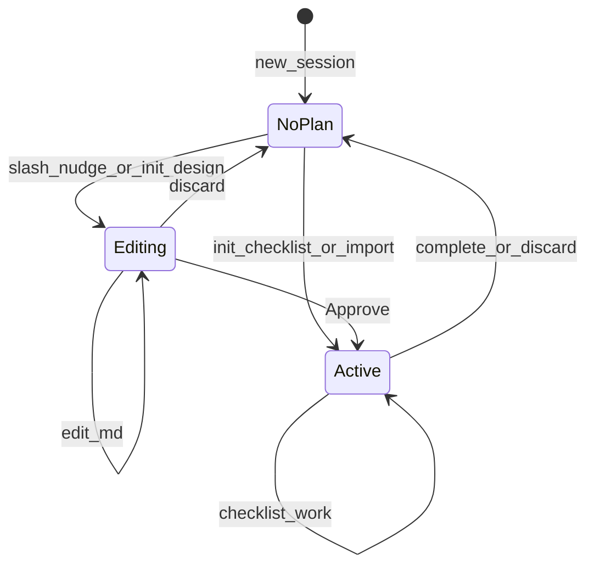

# ADR 0003 — Plan lifecycle engine

- **Status:** Accepted
- **Cluster:** C — Plan engine
- **Date:** 2026-07-12
- **Umbrella:** [src/docs/reference/plans/plan-mode/umbrella.md](umbrella.md)
- **Umbrella phases:** 3–5 (status/gate, `.md` mirror, plan tool contract)

## Context

Today the `plan` tool exposes four operations (`init`, `add_task`, `start`, `complete`) with no `mode`. The first `start` auto-approves the plan and sets `approved_at`, which conflates checklist progress with user design approval. Status is a seven-value enum persisted as strings in JSON; SQLite `plans` / `plan_tasks` tables and [src/services/plan.rs](../../../../services/plan.rs) exist but are dormant on the production agent path. There is no durable pre-init flag, no design-versus-checklist split, and no session `.md` as the Editing source of truth.

TUI lifecycle code still assumes the seven-status world. [src/tui/app/messaging.rs](../../../../tui/app/messaging.rs) `send_message` clears non-`InProgress` plan chrome on every user message, which would wipe Editing once the enum collapses. [src/tui/app/state.rs](../../../../tui/app/state.rs) `reload_plan` deletes idle `InProgress` JSON when the agent is not processing — after migration that path would destroy idle Active plans and seed-failed empty-task Active sessions. Those match-arm bugs belong with the status migration in this cluster, not with Cluster D UX polish.

This cluster builds the **engine**: session states, durable pre-init, write/bash gates, markdown mirror, and tool contract. It can ship without full Plan mode UX (slashes, Approve keyboards, overlays). Agents and tools then behave correctly even with thin UI. Channel commands, Approve, seed turn, and surfaces are Cluster D ([0004-plan-mode-ux.md](0004-plan-mode-ux.md)).

## Decision

Introduce **NoPlan / Editing / Active** as the live session model. Editing splits into **pre-init** (durable minimal JSON flag, no approvable `.md`) and **post-init** (`.md` + `.json` after successful `plan init`). Persist pre-init so it survives restart; do not store it on `AgentContext` (rebuilt every turn).

Write policy is asymmetric on purpose: pre-init denies project file writes but **allows exploratory bash** and `plan init` so the agent can investigate before committing to a design doc; post-init Editing allows writes only to the session `.md` and **denies all bash**; Active freezes the live `.md` against generic write tools.

First `plan init` from pre-init **upgrades or replaces** the sidecar — it must not be refused as “plan already live.” Design `init` upgrades to post-init Editing. Checklist `init` or import from pre-init replaces the flag and goes Active without `/discard`. Refuse further `init` only once a post-init `.md` or Active checklist exists.

JSON remains the live store; do not dual-write SQLite. Map legacy status strings on load; keep `approved_at` on the struct but stop setting it on first `start`. Cluster D sets `approved_at` when the user Approves (or first `/execute`) on the design track.

Extend the tool contract with `mode=design|checklist`, primary `add_tasks` plus `add_task` alias, import/archive rules, and criteria → `GoalManager`. Document light template B in [src/docs/reference/plans/plan-mode/json-spec.md](json-spec.md) as the Editing outline (Approve validator and seed extraction remain Cluster D).

## Product model (normative for this cluster)

### Lifecycle states



**NoPlan** means there are no live plan artifacts and no durable pre-init Editing flag.

**Editing** means the session owns design prose only — no checklist execution. It has two sub-states:

- **Pre-init:** the user has entered Plan mode intent (`/plan` or soft-nudge — wired in Cluster D / A) but `plan init` has not succeeded yet. On disk: minimal JSON flag only; no session `.md`.
- **Post-init:** `.md` and `.json` exist after a successful `plan init` (design track). `tasks` stay empty until Approve seed (Cluster D).

**Active** means the checklist is live. If a design `.md` exists, it is frozen against generic write tools.

**Complete** (last task `complete`) archives plan artifacts under `.../session/archive/` with a timestamp, clears plan chrome, and returns the session to NoPlan. There is no lingering live Done status.

**Discard** (Cluster D commands; engine must support clearing flag / deleting artifacts) cancels an in-flight turn if needed, deletes plan artifacts or clears the pre-init flag, and returns to NoPlan.

### Pre-init versus post-init (locked)

`/plan` and soft-nudge enter Plan mode intent without creating an approvable plan. Until `plan init` succeeds, Approve and `/execute` stay refused. That gap is pre-init Editing. This cluster owns the durable flag API and gates; slash wiring and soft-nudge `pre_init_editing` writes land in Cluster D (and A’s hint swap).

Engine-facing state facts (what must exist on disk / in the harness). The normative `/plan` / `/execute` / Approve / `/discard` command matrix — including idle versus busy refuse rules — lives only in [0004-plan-mode-ux.md](0004-plan-mode-ux.md); do not re-own it here.

| State | On disk | Harness flag | Engine notes |
|---|---|---|---|
| NoPlan | none | off | No plan artifacts |
| Editing pre-init | minimal JSON flag only (no `.md`) | on (durable) | No approvable `.md`; Approve/`/execute` must refuse (D wires) |
| Editing post-init | `.md` + `.json`, `tasks` empty | on / derived from files | Design prose only; checklist ops blocked until Active |
| Active (seed failed) | `.md` frozen, `tasks` empty | off | Keep empty-task Active intact for D’s idle seed retry |
| Active (checklist) | `.md` + `.json`, `tasks` non-empty | off | Checklist ops allowed per tool contract |

**Discard cleanup the engine must supply** (Cluster D wires the command and cancel-turn UX): clear the durable pre-init flag / delete the minimal sidecar; or delete post-init / Active artifacts (`.md` and `.json`) and return to NoPlan. Exit without `init` uses the same `/discard` path (and the TUI equivalent). There is no separate `/cancel` in v1.

### Durable pre-init persistence (locked)

`pre_init_editing` must survive process restart. It must **not** live on `AgentContext`, because that struct is rebuilt from the database every turn. The default durable shape is a minimal session JSON sidecar in the same path family as `.opencrabs_plan_{session_id}.json`, with `pre_init_editing: true` (and/or `status: "Editing"`), empty `tasks`, and no checklist body. The session `.md` appears only after successful `plan init`.

TUI `AppState` may mirror the flag for chrome; brain code reads the same sidecar (or a thin API over it). A session-row column is an allowed equivalent if implementers prefer it, as long as semantics stay durable, shared across TUI and Telegram, and free of an approvable `.md` until `init`.

Earlier wording “no files until init” is narrowed: pre-init may leave a **minimal flag sidecar**, but it must not create an approvable plan or session `.md`.

### Tracks the engine must support

**Track A — design (`mode=design`).** `init` with no tasks (or explicit `mode=design`) creates `.md` + `.json`, writes the title, enters post-init Editing, and returns the absolute `.md` path for subsequent turns. Checklist ops other than those allowed in Editing are blocked until Active. User Approve → Active and seed turn are Cluster D; this cluster freezes `.md` once Active and enables checklist ops.

**Track B — checklist (`mode=checklist`).** `init` with non-empty `tasks`, after existing tool approval on `init`, goes Active immediately. No Approve. The agent may `start` and `complete` at once.

**Track C — import.** `init(file_path=…)` from **NoPlan or pre-init** only, any readable path, non-empty `tasks` required. From pre-init, import **replaces** the flag and skips Editing → Active immediately (no `/discard`). From post-init Editing or Active, refuse import; user must Discard first. No design-track seed turn because tasks are already structured.

Yolo, cron, `run`, and a2a never enter Editing. Checklist and import remain allowed under the existing approval policy.

### `init` disambiguation and pre-init upgrade rules (locked)

When `mode` is omitted, tasks present imply `checklist` and no tasks imply `design`. `mode=design` with tasks is refused. `mode=checklist` with empty `tasks` is refused (same as empty import). When `file_path` is set, treat the call as import: ignore `mode` and require tasks.

A further `init` while a plan is **post-init Editing or Active** is refused with “Discard first.” **Pre-init is not “live” for that refuse rule.** The first successful `plan init` upgrades or replaces the minimal pre-init sidecar:

- **`init mode=design`** (or omitted mode with empty tasks) upgrades pre-init → post-init Editing (creates `.md`, empty `tasks`).
- **`init mode=checklist`** or **import** from pre-init **replaces** the pre-init flag and goes **Active** immediately (no `/discard` required). Users who typed `/plan` then change their mind are not trapped.
- Once a **post-init** `.md` exists (or Active checklist is live), a further `init` requires Discard first.

Today’s tool may replace an existing session plan file on `init` — that upgrade/replace path is the intended happy path after `/plan` / soft-nudge. Tool approval on `init` is unchanged. `/plan` and soft-nudge still do not create an approvable `.md`; they set durable pre-init Editing (Cluster D / A).

### Legacy status load map

On JSON load, map seven legacy strings without breaking plans already on disk:

| Legacy string | Becomes |
|---|---|
| Draft, PendingApproval, Rejected | Editing |
| Approved, InProgress | Active |
| Completed | silently archive, then NoPlan (no user-visible migration notice) |
| Cancelled | NoPlan |

Replace the `PlanStatus` enum in [src/tui/plan.rs](../../../../tui/plan.rs) with Editing and Active for live UI (Cancelled only if a tombstone is kept; v1 prefers delete on discard), plus a load-time legacy map. UI and reminders should speak Editing versus Active, not legacy Approved or InProgress names.

### Status on write (canonical JSON `status`)

| Event | JSON `status` written | Notes |
|---|---|---|
| `init mode=design` | `"Editing"` | `tasks` empty; create `.md` |
| `init mode=checklist` or import | `"Active"` | non-empty `tasks` |
| User Approve / first `/execute` (design) | `"Active"` | set `approved_at`; seed turn follows — **wired in Cluster D** |
| Last task `complete` | archive files | no live JSON — NoPlan |
| `/discard` (D wires; engine cleanup) | delete files / clear flag | NoPlan |

Keep `approved_at` on the JSON struct. Phase C3 removes today’s auto-approve-on-start behavior. Cluster D sets the field on user Approve. Grep `approved_at` readers in this cluster’s docs/cleanup when auto-approve dies; finish the consumer audit when Approve sets the field (Cluster D).

### Storage

Plan artifacts live under `~/.opencrabs/agents/session/`.

| Store | Role |
|---|---|
| `.opencrabs_plan_{session_id}.json` | **Live.** Status, title, checklist, optional Telegram flow-message ids. Minimal pre-init sidecar uses this path family. |
| `.opencrabs_plan_{session_id}.md` | Canonical design prose while Editing (post-init). Created on design `init`; frozen while Active. |
| SQLite `plans` / `plan_tasks` | **Dormant.** Schema in [src/migrations/20251111000001_add_plans.sql](../../../../migrations/20251111000001_add_plans.sql); repository in [src/db/repository/plan.rs](../../../../db/repository/plan.rs); wrapper in [src/services/plan.rs](../../../../services/plan.rs). |

What is live today for the agent and TUI is only the JSON sidecar and (after C2) the session markdown file. The `plan` tool and TUI `reload_plan` read and write those files. New plans actively use title and description at the JSON root. Older JSON may contain extra root fields — keep them on load, but stop prompting the model for them.

While Editing, sync `.md` content into `description` on save and keep `tasks` empty. When the checklist completes, archive both files under `.../session/archive/` with a timestamp.

Nothing in the production agent path calls `PlanService` today — only tests and wiring in `ServiceContext`. Do not introduce dual-write to SQLite unless we deliberately re-enable that path. In C3 docs/cleanup: confirm zero production callers, then either teach the dormant SQLite parser the same legacy map or retire unused `PlanService`.

### Editing write / bash gate (locked)

**Pre-init:** durable flag on, no session `.md` yet.

- Deny **project file writes** (write/edit/hashline and similar mutators outside the eventual session plan path).
- **Allow exploratory bash** (and reads/search) so the agent can investigate before `plan init`.
- Allow `plan init`.
- Deny checklist ops other than `init`, spawn/team mutators that write the project, channel sends, and browser mutators — same spirit as post-init except bash stays available for exploration.
- There is no session `.md` to write yet.

**Post-init Editing:**

- Allow reads and search, `follow_up_question`, and write or edit **only** to the session `.md`.
- Deny other project writes, **all bash**, spawn and team, channel sends, browser mutators, checklist ops other than those allowed in Editing, and import.
- The Track A line “all bash denied while Editing” applies to **post-init** only.

**Active:** freeze the live `.md` against generic write tools. Checklist ops (`add_tasks`, `start`, `complete`) are allowed per the tool contract.

### Checklist API (engine contract)

`add_tasks` appends one or more tasks in a single call (array length at least one). It is the primary operation going forward: blocked while Editing, unlimited while Active. `add_task` remains a backward-compatible alias that behaves like `add_tasks` with a single task. Keep it in the tool schema and description until Cluster D Phase D2 updates prompts to prefer `add_tasks`. A hard rename mid-session would leave in-flight models calling a dead operation. Mark deprecation in docs only after prompts switch (Cluster D).

`start` and `complete` are Active only. Remove today’s behavior where the first `start` auto-approves the plan.

Title and description are required on each task; dependencies and status are first-class. Acceptance criteria are optional — include them when the plan or model supplies them (`Done when:` in `.md` after seed, or explicit criteria on checklist/import). Keep complexity, `task_type`, and artifacts on the struct but stop prompting for them by default.

When a started task has non-empty criteria, push them into `GoalManager::set_goal` and clear on complete, skip, or discard. Tasks without criteria get no goal chrome.

**Building checklist…** is a UI state machine owned by Cluster D surfaces, but the engine must leave Active with empty `tasks` intact after a failed seed so chrome and `/execute` retry can work. Do not delete idle Active JSON when `tasks` is empty.

### Light template B (documentation ownership)

While Editing, the session `.md` is not freeform essay prose. It uses a small fixed outline so the post-Approve seed turn (Cluster D) can map steps to checklist tasks without a harness markdown AST parser. The model still writes natural language inside each section; only the headings, context labels, and step numbering are structural.

**This cluster (C2) documents** the outline in [src/docs/reference/plans/plan-mode/json-spec.md](json-spec.md) and optionally warns when required sections are missing without blocking writes. **Cluster D** owns the Approve validator (Rust scan) and model-driven seed extraction.

Required outline:

```markdown
# {Plan title — mirrors JSON title}

## Context
- **Problem:** {what is wrong, missing, or painful today}
- **Target state:** {what “done” looks like for this session’s scope}
- **Intent:** {why now — priority, user ask, or tradeoff driving this work}
- **Constraints:** {compatibility, must-not-touch, deadlines — omit bullet if none}
- **Out of scope:** {explicit non-goals — omit bullet if none}

## Implementation steps
1. {Step title} — {what to do, files/modules, commands if any}
2. {Step title} — {what to do}
   - Done when: {optional acceptance bullet}
3. {Next step}
   ...
```

`## Context` is required before Approve (Cluster D). Problem, Target state, and Intent must each be filled with non-empty text after the label. Constraints and Out of scope are optional. Context is never converted into checklist tasks. The full `.md` body syncs into JSON `description` on save in Phase C2. `## Implementation steps` needs at least one numbered step before Approve; it is the only section the seed turn maps to `tasks[]`. Optional sections (`## Risks`, `## Open questions`, `## Notes`) may help humans but are ignored on seed extraction.

### Deterministic tool results (model navigation)

Return fixed, deterministic tool results for common mistakes: design `init` tells the model to edit the `.md` and wait for Approve; checklist or import `init` tells the model to call `start` now; checklist operations while Editing are blocked with a clear reason; a second `init` while a plan is live (post-init / Active) is refused; `mode=design` with tasks, yolo plus design, or empty import is refused with the allowed alternative.

### Deviation policy (engine-relevant)

If status persistence fails while Editing, keep the `.md` as source of truth and surface the error; do not block Planning on UI success. Flow send/edit retry and `/show-plan` restick are Cluster D.

If the seed turn finishes with empty `tasks`, the engine must **keep Active** — do not archive or delete idle empty-task Active JSON. Empty-versus-partial recovery commands (`/execute` retry versus `/discard` then re-approve) are normative only in Cluster D.

Do not add checklist items in Editing, revive `propose_plan`, or dual-write SQLite without an explicit decision.

## Considered options

| Option | Outcome |
|---|---|
| Hard-deny bash in pre-init | Safer but blocks investigation before `init` — rejected |
| Soft gate only until post-init | Weaker than Track A — rejected in favor of deny-writes / allow-bash in pre-init |
| Process-local `AgentService` flag only | Lost on restart — rejected; durable sidecar chosen |
| Require `/discard` before checklist/import from pre-init | Traps users who typed `/plan` then changed mind — rejected |
| Dual-write JSON + SQLite | Adolfo audit: SQLite is dormant; dual-write rejected unless deliberately re-enabled |
| Hard-rename `add_task` → `add_tasks` | Breaks mid-session models — rejected; alias kept until D2 prompt switch |
| Defer TUI `send_message` / `reload_plan` fixes to Cluster D | Enum collapse would clear Editing and delete idle Active — rejected; fix with C1 |

## Consequences

Callers get a coherent lifecycle without waiting for Telegram/TUI chrome. Mid-flight models keep working via the `add_task` alias. TUI lifecycle bugs that clear or delete Active plans must be fixed when the enum collapses. Implementers must treat `pre_init_editing` as a first-class bit, not “file exists ⇒ live plan.” Cluster D can wire Approve, seed, and surfaces on a stable engine. Compaction gets a minimal C1 stub so Editing is not told to `plan start`; full Editing/Active recovery rewrite stays in Cluster D Phase D2.

## Phases

### Phase C1 — Status, pre-init, and Editing gate (umbrella Phase 3)

Prefer two PRs when practical (OC Dev sequencing):

**C1a — types, load map, durable flag, paths, compaction stub**

- Introduce Editing, Active, and NoPlan in [src/tui/plan.rs](../../../../tui/plan.rs) (and shared brain types as needed). NoPlan means no plan artifacts and no durable pre-init flag.
- Legacy JSON load map (table above); silent Completed archive.
- Durable `pre_init_editing` API on the minimal JSON sidecar (survives restart; not on `AgentContext`). TUI mirrors for UI.
- Path helpers for `.md`, `.json`, and archive.
- Compaction-reminder stub: stop injecting Active-only `format_plan_reminder` / `plan start` recovery when pre-init is set or JSON maps to Editing — a minimal branch until Cluster D’s full rewrite.
- Rewrite TUI `send_message` / `reload_plan` match arms when collapsing the enum so:
  - Editing chrome is not cleared on every user message.
  - Idle Active plans (including seed-failed empty-task Active) are not deleted on reload.

**C1b — tool-loop write/bash gate + Active `.md` freeze + dedicated tests**

- Wire the tool-loop gate for pre-init and post-init rules above; Active freezes the `.md` against generic write tools.
- Dedicated gate tests so legitimate session-`.md` writes still succeed while bash is hard-denied in post-init Editing and project writes fail in both Editing sub-states as specified.
- Do not merge C1b without that isolated coverage — it is the highest-risk surface.

Channel slash wiring stays in Cluster D. Mode-aware `init` that exercises write helpers is Phase C3.

**Done when:**

- Project writes fail in Editing post-init; session `.md` writes succeed; other `~/.opencrabs` writes fail; Active blocks `.md` writes via generic tools.
- Pre-init denies project writes but allows exploratory bash and `plan init` under test.
- Durable pre_init API works under test.
- Legacy JSON loads and maps; Completed archives silently.
- Status write helpers persist canonical `"Editing"` / `"Active"` strings.
- `approved_at` is preserved on the struct (not set by this phase’s remaining auto-approve path until C3 removes it).
- TUI match arms no longer clear Editing or delete idle Active.
- Compaction stub does not tell Editing to `plan start`.

### Phase C2 — Session markdown and mirror (umbrella Phase 4)

Create and update the session `.md`; sync the full body to JSON `description`; keep `tasks` empty in Editing; emit plan-file-changed events. Document light template B in [src/docs/reference/plans/plan-mode/json-spec.md](json-spec.md). Optionally warn when required sections are missing without blocking writes.

**Done when:**

- Edits update `description` and fire events.
- Editing cannot persist a checklist.
- Template sections are documented and visible to prompts.

### Phase C3 — Plan tool contract (umbrella Phase 5)

Extend [src/brain/tools/plan_tool.rs](../../../../brain/tools/plan_tool.rs):

- Restrict `start` and `complete` to Active.
- Remove auto-approve on first `start`.
- Add `mode` (`design` | `checklist`) with Product model disambiguation and pre-init upgrade/replace rules.
- Add `add_tasks` as primary with `add_task` as alias.
- Support import from NoPlan or pre-init (any readable path, non-empty tasks); refuse from post-init Editing or Active.
- Archive and return to NoPlan on last `complete`.
- Wire acceptance criteria to `GoalManager` (set on start, clear on complete/skip/discard).
- Tighten success and refuse strings; slim title/description prompting.
- Update [src/docs/reference/plans/plan-mode/json-spec.md](json-spec.md) for the tool contract.

**Done when:**

- Editing blocks checklist operations.
- Checklist and import reach Active; empty import is refused.
- Active sessions can append via `add_tasks` and the alias still works.
- Completing the last task archives to NoPlan.
- Criteria set and clear goals correctly.
- First `start` no longer auto-approves.
- Docs and cleanup for this slice are finished (see below).

### Docs and cleanup (ship across C1–C3, finish with C3)

Keep [src/docs/reference/plans/plan-mode/json-spec.md](json-spec.md) aligned as the engine lands:

- Legacy status load map and canonical write table (C1).
- Light template B and `.md` / `description` mirror (C2).
- `mode` / `add_tasks` / `add_task` alias / import / archive / no auto-approve on first `start` (C3).

Record the JSON-live / SQLite-dormant decision: confirm zero production callers of `PlanService`, then migrate dormant rows with the legacy map or retire that path (including the parser around [src/db/repository/plan.rs](../../../../db/repository/plan.rs)). Grep for `approved_at` readers after auto-approve-on-start is removed and document or update them (user Approve wiring is Cluster D). Remove dead auto-approve paths and stale seven-status enum comments. Add CHANGELOG entries for the engine ship. Update memory bank / CLAUDE.md for status model, write/bash gate, and tool contract — not for end-user `/plan` UX (that is Cluster D).

Attribute engine decisions in plan-json-spec to **Cluster C** (Phases C1–C3 / umbrella 3–5), not to Cluster A’s analyzer work.

## Verification (umbrella Phases 3–5)

**C1 / Phase 3:** Editing gate — bash denied post-init; only session `.md` writable; Active freezes `.md`; durable `pre_init` API under test (slash wiring is Cluster D); legacy JSON statuses load; Completed silent archive; TUI arms safe after enum collapse.

**C2 / Phase 4:** `.md` edits sync to JSON `description`; mirror events fire; Editing cannot persist a checklist; template documented in plan-json-spec.

**C3 / Phase 5:** `init` approval unchanged; design/checklist disambiguation; import equals Active without requiring Discard from pre-init; `add_tasks` and `add_task` alias; archive on last complete; optional criteria to goals; plan-json-spec tool contract; SQLite migrate-or-retire; dead auto-approve cleanup.

## Out of scope for this cluster

Channel slashes (`/plan`, `/show-plan`, `/execute`, `/discard`), Approve/Discard keyboards and callbacks, seed/implement turn and Approve validator, design-track soft-nudge swap and soft-nudge writes of `pre_init_editing`, Mission Control overlay / Active strip / Building checklist… chrome, Telegram Approve/prose and owner-only group rules, full prompt rewrite (minimal compaction stub only in C1), analyzer extract/live-ops (Cluster A), Telegram flow merge / title / goal / checklist sections (Cluster B), end-user README Plan mode walkthrough (Cluster D).

Soft handoffs: Cluster D consumes the durable flag API, gates, tool contract, and template docs; Cluster B’s section builder later shows title/goal/checklist from live JSON this cluster maintains; Cluster A’s hint swap in D may set `pre_init_editing` via this cluster’s API.

## Implementation notes

Umbrella Product model, Storage, Checklist API, Editing write policy, Deviation policy (engine bits), and Phases 3–5 are normative. Prefer putting normative engine detail in this ADR; keep [src/docs/reference/plans/plan-mode/json-spec.md](json-spec.md) as the concise implementation reference for status strings, template B outline, and tool contract. Read first: this ADR; umbrella Product / Storage / Editing write policy / Checklist API / Phases 3–5 / Verification 3–5; [src/brain/tools/plan_tool.rs](../../../../brain/tools/plan_tool.rs); [src/tui/plan.rs](../../../../tui/plan.rs); TUI `send_message` / `reload_plan` arms.
