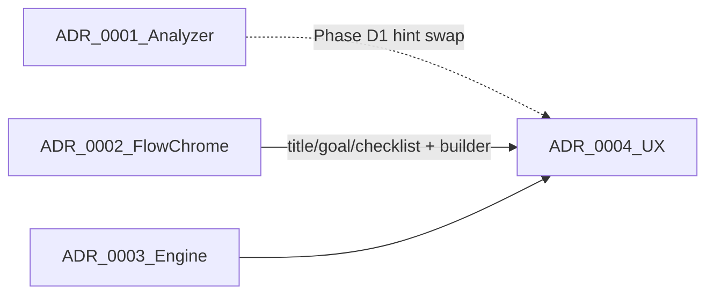

# Plan mode — implementation clusters

This folder splits the Plan Mode Feature work into **independent value clusters**. Each cluster is an ADR with its own phases, done criteria, and ship boundary. Documentation, cleanup, and memory-bank updates for that slice live **inside the same ADR** — there is no separate docs cluster.

Clusters A and B can ship in any order and do not require the Plan mode lifecycle. Clusters C and D are sequential: C is the engine; D is the user-visible product story on top of it.

**Umbrella plan (SSOT):** [src/docs/reference/plans/plan-mode/umbrella.md](umbrella.md) remains the full product narrative and locked-decision source of truth until implementation finishes. These ADRs are the **execution slices** carved from that plan. When product questions conflict, trust the umbrella over an ADR summary.

**Related spec:** [src/docs/reference/plans/plan-mode/json-spec.md](json-spec.md)

## Cluster map

| ADR | Cluster | Standalone value | Depends on |
|---|---|---|---|
| [src/docs/reference/plans/plan-mode/0001-prompt-analyzer-parity.md](0001-prompt-analyzer-parity.md) | A — PromptAnalyzer | Live-ops plan hints; shared TUI + Telegram keyword analyzer | None |
| [src/docs/reference/plans/plan-mode/0002-telegram-flow-chrome.md](0002-telegram-flow-chrome.md) | B — Telegram flow chrome | One live flow message; ctx on flow; resume parity; **title / goal / checklist** sections | None |
| [src/docs/reference/plans/plan-mode/0003-plan-lifecycle-engine.md](0003-plan-lifecycle-engine.md) | C — Plan engine | Editing/Active/NoPlan; gates; `.md` mirror; tool `mode` / `add_tasks` | None for function; soft reuse of B’s section builder later |
| [src/docs/reference/plans/plan-mode/0004-plan-mode-ux.md](0004-plan-mode-ux.md) | D — Plan mode UX | `/plan` Approve seed; design-track soft-nudge; TUI overlay; Telegram Approve + Editing prose | C hard; A soft (hint swap); B soft (flow builder + title/goal/checklist) |

## Shipping guidance

1. Ship **A** and/or **B** whenever ready — each is a complete user-visible win, including that cluster’s docs.
2. Ship **C** as the engine release (agents and tools behave correctly even with thin UI).
3. Ship **D** as the product story (design → Approve → checklist on TUI and Telegram), including end-user README and memory bank alignment.

Do not start C’s later phases until C’s earlier phases meet their done criteria. Do not start D until C is green. Soft dependencies are deliberate: A and B may run in parallel; D prefers both but only hard-requires C.

## Process log

This section records how the plan evolved so implementers do not rediscover dead ends or treat early drafts as current truth.

Work began with the **grill-for-unknowns** skill: a docs-grounded grill plus a map-versus-territory unknowns pass before locking the model. Early territory checks found overlapping “plan” concepts already in the tree (the live `plan` tool and JSON sidecar, a Plan sub-agent type, dormant SQLite plan tables, and a previously deleted TUI Plan Mode). The grill forced explicit choices instead of inventing a second planning system beside the existing tool.

The first locked UX assumed a Telegram **Bot API pin** as the living plan surface. Reviews and codebase reality reversed that. Plan chrome now extends the **per-turn Telegram flow message** (the processing log users already see during a turn): one live message per turn, with title, checklist, goals, ctx, and later Approve/Discard on that same message. Pin-era notes shared in OC Dev (including `opencrabs-plan-mode.md`) are historical only and are not source of truth.

The product model solidified into a **dual track**. Design track (`mode=design`) writes session-plan prose, waits for user Approve, then seeds a checklist and auto-starts task 1. Checklist and import tracks go **Active** immediately after approved `init` with tasks — no `/execute`, no Approve. Full lifecycle, template, and seed rules live in the umbrella; this folder only points at them.

**Adolfo** and **OC Dev bot** reviews were folded into the umbrella rather than left as chat-only corrections. Useful citations:

- [Adolfo audit #12671](https://t.me/c/3627148483/12671) (after [#12670](https://t.me/c/3627148483/12670)): reject reopening Bot API pin; treat JSON as live and SQLite as dormant; keep `add_task` as an alias; v1 surfaces are TUI + Telegram.
- Flow-versus-widget alignment: [#12650](https://t.me/c/3627148483/12650).
- TUI overlay UX review required in Cluster D / Phase 8: [#12656](https://t.me/c/3627148483/12656).
- Full bot thread: [#12673](https://t.me/c/3627148483/12673) → partial [#12678](https://t.me/c/3627148483/12678) → [#12684](https://t.me/c/3627148483/12684) → greenlight [#12688](https://t.me/c/3627148483/12688).

Accepted review pushbacks that still shape execution include splitting the engine gate for isolated tests, fixing analyzer hint strings (not keyword lists) in Cluster A, refuse-while-busy for Approve/`/execute`, and documenting entry asymmetry (Telegram `/plan` versus TUI keyword lean) with Cluster D.

The large umbrella was then split into **cluster ADRs** under this folder so each slice can ship on its own. Docs, cleanup, and memory-bank updates fold into each ADR. There is **no Cluster E** and **no Phase 9** docs-only phase. Umbrella phases 1–8 map to clusters as A=1, B=2, C=3–5, D=6–8.

A later ownership fix moved **title / goal / checklist** flow sections from Cluster D into **Cluster B**, so B ships standalone plan visibility from live JSON without waiting for Approve chrome. Cluster D attaches Editing prose, Approve/Discard, and Building checklist… onto B’s section builder.

The umbrella plan and [src/docs/reference/plans/plan-mode/json-spec.md](json-spec.md) were then **moved into this folder** (out of `~/.cursor/plans/` and `src/docs/reference/plans/` respectively) and renamed to `umbrella.md` and `json-spec.md` so ADRs, SSOT narrative, and the JSON/spec live together under clear names. The bundled runtime copy written to `~/.opencrabs/.../plans/` remains named `plan-json-spec.md` for compatibility. The umbrella remains the **SSOT** for contested product questions. ADRs are shippable execution slices with done criteria; they summarize decisions but do not replace the umbrella narrative.

## Cross-cutting leftovers

These items span clusters. Prefer the umbrella for full wording; this list exists so they are not lost if someone only reads ADRs.

| Topic | One-liner | Where detail lives |
|---|---|---|
| Glossary | Session plan = `.md` design prose; checklist = JSON `tasks[]`; flow message = per-turn Telegram processing log; `plan` tool ≠ `/plan` slash | Umbrella Vocabulary |
| Product model | Dual track: design → Approve → seed vs checklist/import → Active; NoPlan / Editing (pre-init + post-init) / Active | Umbrella Product model (do not duplicate here) |
| v1 surfaces | TUI + Telegram only; CLI plan slashes and Discord/Slack/WhatsApp/Trello deferred | Umbrella Goal / Out of scope |
| Storage | JSON sidecar + session `.md` are live; SQLite `plans` / `plan_tasks` exist but are dormant on the agent path — no dual-write unless deliberately re-enabled | Umbrella Storage; Cluster C docs/cleanup |
| Architect alias | Prefer `spawn_agent(agent_type="architect")`; `"plan"` remains a valid alias mapping to the same type | Umbrella Vocabulary; Cluster D Phase D2 |
| Refuse while busy | Approve and `/execute` refuse immediately while a turn runs — never queue into mid-turn inject | Umbrella Commands; Cluster D |
| Soft deps | A ∥ B first; then C → D. D soft-reuses A (hint swap) and B (flow builder) | This README + ADRs |
| Light template B | Fixed `.md` outline (Context + numbered Implementation steps) so Approve can validate and seed can map steps | Umbrella Session plan `.md` format; Cluster C Phase C2 + [src/docs/reference/plans/plan-mode/json-spec.md](json-spec.md) |
| Collapse / refresh | Keep 1.5s `refresh_flow`; accept client expand reset (#480 option 1); always-visible chrome is title, progress, goal one-liner, ctx | Umbrella Surfaces; Cluster B |
| Pin-era docs | OC Dev `opencrabs-plan-mode.md` and any Bot API pin design are not SoT | Umbrella Review feedback; Cluster D docs/cleanup |
| Deviation policy | UI send failure must not orphan `.md`; strip Approve keyboards from older flow messages; empty-task seed → idle retry; partial seed → discard-only in v1 | Umbrella Deviation policy; engine constraints in Cluster C; recovery UX in Cluster D |
| Yolo / non-interactive | Yolo + explicit `/plan` slash enters Editing (review gate); `/execute` resumes full-rush. No slash → checklist/Active or no plan chrome. cron, `run`, a2a never enter Editing | Umbrella Product model; 0003 amendment |
| Review-ops note | In-context attachment truncation during OC Dev bot review is separate ops work, not Plan mode product scope | Umbrella Review feedback only |

## How to use this folder

1. **Implement from the ADRs.** Follow each cluster’s phases and done criteria. Ship docs and cleanup listed in that ADR with the same release.
2. **Consult the umbrella for contested product questions.** Lifecycle edge cases, template strictness, seed recovery, and deviation policy are normative in [src/docs/reference/plans/plan-mode/umbrella.md](umbrella.md).
3. **Update ADR done-criteria when shipping.** Mark what landed; keep the umbrella overview in sync when product decisions change — do not treat ADRs as a license to rewrite the SSOT casually.
4. **Do not treat pin-era OC Dev docs as source of truth.** Extend the per-turn flow message; do not revive Bot API pin as a second Telegram surface.
5. **Keep [src/docs/reference/plans/plan-mode/json-spec.md](json-spec.md) aligned** as engine and UX decisions land (status map, template, tool contract, flow-versus-pin notes).
