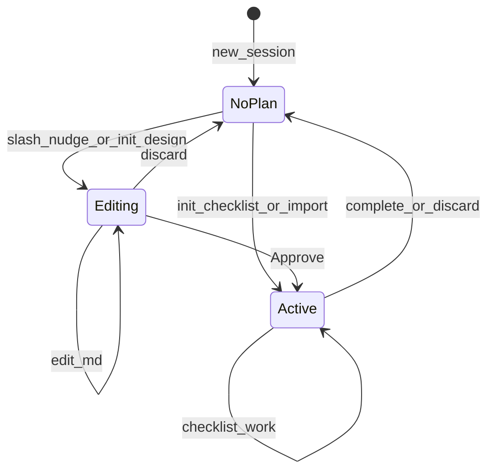
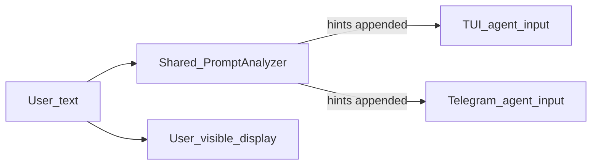
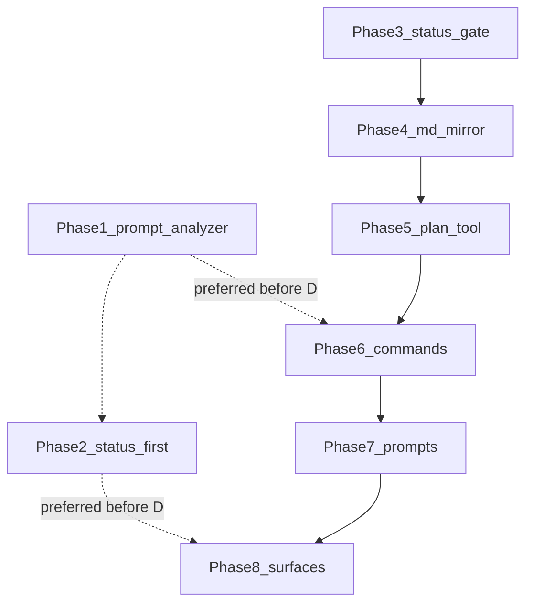

# Plan Mode

## Goal

Plan mode gives a session a clear lifecycle for complex work. The agent either designs a session plan the user reviews and Approves, or starts a self checklist and executes immediately. Both paths use the existing `plan` tool and JSON sidecar. This work does not invent a second planning system.

On Telegram, Plan mode extends the existing flow message — the processing log users already see during a turn. Phase 2 adds plan title, checklist progress, goals, and the ctx footer. Phase 8 adds Editing prose and Approve/Discard. The ctx footer moves off the final answer so the reply stays clean prose. Clock, tool list, and intermediate narration stay as they work today.

v1 ships on TUI and Telegram. CLI plan slash commands and Discord, Slack, WhatsApp, and Trello stay deferred.

---

## Vocabulary

A **session plan** is design prose in a session `.md` file. The product name for that experience is Plan mode.

A **checklist** is the JSON `tasks[]` array driven by the `plan` tool. Prompts and UI must not call the checklist “the plan.”

The **`plan` tool** owns session checklist operations: `init`, `add_tasks`, `start`, and `complete`. During rollout, `add_task` remains as an alias (see Checklist API). The tool name is not the `/plan` slash command. The existing tool-approval gate on `init` stays unchanged.

**`init` modes** split the two tracks: `design` enters Editing and waits for user Approve; `checklist` goes Active immediately. Do not name a mode `plan` — that clashes with the tool itself.

A **flow message** is Telegram’s processing-log message managed in [src/channels/telegram/flow.rs](src/channels/telegram/flow.rs) via `open_group_msg_id`. Today it shows tools, intermediates, and a live clock. Plan mode adds plan title, checklist, goals, and the ctx footer in Phase 2, then Editing prose and Approve/Discard in Phase 8, into that same message. Identity stays one new flow message per turn. Prefer the term “flow message” over “living UI” or “session-status.” The header may still read as activity (`⚙️ … • duration`).

**Architect** is the preferred spawn type for planning work: `spawn_agent(agent_type="architect")`. The string `"plan"` remains a valid alias and already maps to the same agent type in [src/brain/tools/subagent/agent_type.rs](src/brain/tools/subagent/agent_type.rs) (`"plan" | "architect" | "design"` → `Plan`). Phase 7 adds `architect` to spawn and team JSON enums and docs; do not remove the `plan` alias.

**`task_manager`** is deprecated. New work should use `mode=checklist` instead.

---

## Product model

### Lifecycle



**NoPlan** means there are no live plan artifacts and no durable pre-init Editing flag.

**Editing** means the session owns design prose only — no checklist execution. Editing has two sub-states. **Pre-init** means the user has entered Plan mode intent but `plan init` has not succeeded yet (durable minimal JSON flag, no `.md`). **Post-init** means `.md` and `.json` exist after a successful `plan init`.

**Active** means the checklist is live. If a design `.md` exists, it is frozen.

**Complete** archives plan artifacts, clears plan sections from status UI, and returns the session to NoPlan. There is no lingering live Done status.

**Discard** cancels an in-flight turn if needed, deletes plan artifacts (or clears the pre-init flag), clears plan chrome, and returns to NoPlan.

Legacy status strings map as follows: Draft, PendingApproval, and Rejected become Editing; Approved and InProgress become Active; Completed silently archives then becomes NoPlan (no user-visible migration notice); Cancelled becomes NoPlan.

### Pre-init Editing (locked)

`/plan` and soft-nudge (the shared PromptAnalyzer) enter Plan mode intent without creating an approvable plan. Until `plan init` succeeds, Approve and `/execute` stay refused. That gap is pre-init Editing.

| State | On disk | Harness flag | `/execute` / Approve when idle | `/execute` when busy |
|---|---|---|---|---|
| NoPlan | none | off | refuse | forbidden |
| Editing pre-init | minimal JSON flag only (no `.md`) | on (durable) | refuse | forbidden |
| Editing post-init | `.md` + `.json`, `tasks` empty | on / derived from files | first approve if template valid | forbidden |
| Active (seed failed) | `.md` frozen, `tasks` empty | off | seed retry if template valid | forbidden |
| Active (checklist) | `.md` + `.json`, `tasks` non-empty | off | refuse (not applicable) | forbidden |

| State | `/discard` |
|---|---|
| NoPlan | not applicable |
| Editing pre-init | clears durable flag / deletes minimal sidecar → NoPlan |
| Editing post-init / Active | cancel turn if needed; delete artifacts → NoPlan |

Exit without `init` uses the same `/discard` command (and the TUI equivalent). There is no separate `/cancel` in v1.

**Persistence (locked after grill on 2026-07-12).** `pre_init_editing` must survive process restart. It must not live on `AgentContext`, because that struct is rebuilt from the database every turn. The default durable shape is a minimal session JSON sidecar in the same path family as `.opencrabs_plan_{session_id}.json`, with `pre_init_editing: true` (and/or `status: "Editing"`), empty `tasks`, and no checklist body. The session `.md` still appears only after successful `plan init`. TUI `AppState` mirrors the flag for chrome; brain code reads the same sidecar (or a thin API over it). `/discard` in pre-init deletes that minimal sidecar or clears the flag and returns to NoPlan. A session-row column is an allowed equivalent if implementers prefer it, as long as semantics stay durable, shared across TUI and Telegram, and free of an approvable `.md` until `init`.

Earlier wording that said “no files until init” is narrowed: pre-init may leave a **minimal flag sidecar**, but it must not create an approvable plan or session `.md`.

The first design-track `plan init` creates `.md` and `.json`, writes the title, enters Editing post-init, and gives the agent the absolute `.md` path on subsequent turns.

### Track A — Plan mode (`mode=design`)

The design track is for work the user wants to review before execution. Entry is `/plan`, a plan-keyword soft-nudge, or `init` with no tasks. While **post-init** Editing, the agent writes only the session `.md` and **bash requires explicit approval** (RequireApproval, overrides auto-approve), using the light template below. In **pre-init**, project file writes are denied but exploratory bash remains allowed until `plan init` (see Editing write policy). When the user Approves, the session becomes Active and a synthetic implement turn reads `## Implementation steps`, emits one `add_tasks`, then starts task 1 immediately. There is no second gate on the checklist after Approve. Status UI shows checklist progress; archive and clear plan chrome when the checklist finishes.

### Session plan `.md` format (locked — light template B)

While Editing, the session `.md` is not freeform essay prose. It uses a small fixed outline so the post-Approve seed turn can map steps to checklist tasks without a harness markdown AST parser. The model still writes natural language inside each section; only the headings, context labels, and step numbering are structural.

Required outline:

```markdown
# {Plan title — mirrors JSON title}

## Context
- **Problem:** {what is wrong, missing, or painful today}
- **Target state:** {what “done” looks like for this session’s scope}
- **Intent:** {why now — priority, user ask, or tradeoff driving this work}
- **Constraints:** {compatibility, must-not-touch, deadlines — omit bullet if none}
- **Out of scope:** {explicit non-goals — omit bullet if none}

## Implementation steps
1. {Step title} — {what to do, files/modules, commands if any}
2. {Step title} — {what to do}
   - Done when: {optional acceptance bullet}
3. {Next step}
   ...
```

`## Context` is required before Approve. Problem, Target state, and Intent must each be filled with non-empty text after the label. Keep each field brief — a sentence or two — because this block frames Approve, while design detail lives under Implementation steps. Constraints and Out of scope are optional; omit those bullets when unused. Context is never converted into checklist tasks.

The full `.md` body (Context, steps, and any optional sections) syncs into JSON `description` on save in Phase 4.

`## Implementation steps` is required before Approve and needs at least one numbered step. It is the only section the seed turn maps to `tasks[]`. Each numbered step becomes exactly one checklist task. Do not nest sub-steps as separate numbers unless they are independently executable.

On each step line, the title is the text before an em dash or the first sentence; the remainder of the line plus following indented bullets (except `Done when:`) become the task description. Optional `Done when:` bullets map to that task’s `acceptance_criteria` after stripping the prefix. Steps without `Done when:` get an empty criteria list; Approve and seed do not require criteria.

List order in the `.md` is the intended execution order for humans and UI. On seed, dependencies default to omitted or empty. The model adds dependencies only when step prose explicitly says depends on, after, or blocked by another step — the same inference rule as the checklist track.

Optional sections below Context (`## Risks`, `## Open questions`, `## Notes`) may help humans read the doc but are ignored on seed extraction. Prefer a short Out of scope bullet in Context when that is enough.

The Phase 6 Approve gate refuses Approve and `/execute` when the `.md` is empty; when `## Context` is missing or Problem, Target state, or Intent are blank (whitespace-only counts as blank); or when `## Implementation steps` is missing or has zero numbered steps. Strictness is locked: any non-empty text after the label is enough — no placeholder heuristics such as “TBD.”

The Approve validator is a lightweight Rust scan of headings and field labels, not a full markdown AST. Seed extraction stays model-driven. That asymmetry is deliberate: a deterministic gate plus LLM mapping.

Freeform-only prose and fenced JSON or YAML inside the `.md` were rejected — the former is hard to extract reliably; the latter is the wrong UX for design-track Plan mode.

### Track B — Self checklist (`mode=checklist`)

Checklist track is for execute-shaped work that already has tasks. `init` with non-empty `tasks` (explicit or inferred), after `init` tool approval, goes Active immediately. There is no `/execute` and no Approve. The agent may `start` and `complete` at once. Discard is the only exit besides completing the checklist.

### Track C — Workflow import

`init(file_path=…)` is allowed from **NoPlan or pre-init** only, from any readable path, with non-empty `tasks` required. From pre-init, import **replaces** the flag and skips Editing → Active immediately after approved `init`, then `start` — same as Track B (no `/discard` required). From post-init Editing or Active, refuse import; the user must Discard first. There is no design-track seed turn because tasks are already structured.

### `init` rules

When `mode` is omitted, tasks present imply `checklist` and no tasks imply `design`. `mode=design` with tasks is refused. `mode=checklist` with empty `tasks` is refused (same as import). When `file_path` is set, treat the call as import: ignore `mode` and require tasks.

When the user says **plan** — including “make a plan”, “plan how we’ll…”, “plan mode”, or “let’s plan this” — treat that as design-track intent: enter Editing or `init` with `mode=design`, write the session plan to `.md`, and wait for Approve. Do not jump straight to a checklist unless they also supply executable tasks or use execute-shaped language (“implement”, “ship”, “do it”, “fix”, “run”).

When the user does not say plan (A3, locked), split by intent shape. Execute-shaped multi-step language (“implement”, “fix”, “refactor”, “audit and fix”, “ship”, “build”, or a clear multi-edit request) should proactively suggest or use checklist track before project writes. Pure questions, research, and read-only exploration do not force the `plan` tool. When ambiguous, prefer one clarifying question (“design first or run a checklist?”) over defaulting to checklist. If design language and execute-shaped language coexist, design wins when “plan” is explicit; otherwise execute-shaped cues favor checklist.

A further `init` while a plan is **post-init Editing or Active** is refused with “Discard first.” **Pre-init is not “live” for that refuse rule:** the first successful `plan init` **upgrades** or **replaces** the minimal pre-init sidecar and must not be refused as a second init. Specifically (locked):

- **`init mode=design`** (or omitted mode with empty tasks) upgrades pre-init → post-init Editing (creates `.md`, empty `tasks`).
- **`init mode=checklist`** or **import** from pre-init **replaces** the pre-init flag and goes **Active** immediately (no `/discard` required). Users who typed `/plan` then change their mind are not trapped.
- Once a **post-init** `.md` exists (or Active checklist is live), a further `init` requires Discard first.

Today’s tool may replace an existing session plan file on `init` — that upgrade/replace path is the intended happy path after `/plan` / soft-nudge. Tool approval on `init` is unchanged. `/plan` and soft-nudge still do not create an approvable `.md`; they set durable pre-init Editing as above.

Yolo + explicit `/plan` slash enters Editing (the review gate — the slash is the deliberate brake; see the amendment in [0003](0003-plan-lifecycle-engine.md)); `/execute` resumes the rush. Agent-initiated design and keyword nudges under yolo stay refused toward checklist. cron, `run`, and a2a never enter Editing. Checklist and import remain allowed under the existing approval policy.

### Storage

Plan artifacts live in the session's resolved data directory, `plan_files::session_dir(session_id)` (async): project-bound sessions use `~/.opencrabs/projects/<slug>/session/`, everything else the profile-aware `<home>/session/`; the legacy flat `~/.opencrabs/agents/session/` remains a read-only fallback. Details in [0003-plan-lifecycle-engine.md](0003-plan-lifecycle-engine.md). Knowing which store is actually live matters for migration; Adolfo’s audit correctly pressed on this.

What is live today for the agent and TUI is only the JSON sidecar and the session markdown file. The `plan` tool and TUI [reload_plan](src/tui/app/state.rs) read and write `.opencrabs_plan_{session_id}.md` (canonical while Editing) and `.opencrabs_plan_{session_id}.json` (status, title, checklist, and optional flow-message ids for Telegram chrome).

New plans actively use title and description at the JSON root. Older JSON may contain extra root fields — keep them on load, but stop prompting the model for them. While Editing, sync `.md` content into `description` on save and keep `tasks` empty. When the checklist completes, archive both files under `.../session/archive/` with a timestamp.

SQLite tables `plans` and `plan_tasks` are gone: `PlanService` and `PlanRepository` were retired in Cluster C after confirming zero production callers, and migration `20260713000001_drop_orphaned_plans_tables.sql` dropped the tables themselves. JSON in the resolved session dir is the single live store; do not reintroduce dual-write to SQLite.

Phase 3 collapses seven legacy `PlanStatus` values into Editing, Active, and NoPlan without breaking plans already on disk. On JSON load, map Draft, PendingApproval, and Rejected to Editing; Approved and InProgress to Active; Completed to silent archive then NoPlan; Cancelled to NoPlan. On write for new plans, persist canonical strings:

| Event | JSON `status` written | Notes |
|---|---|---|
| `init mode=design` | `"Editing"` | `tasks` empty; create `.md` |
| `init mode=checklist` or import | `"Active"` | non-empty `tasks` |
| User Approve / first `/execute` (design) | `"Active"` | set `approved_at`; seed turn follows |
| Last task `complete` | archive files | no live JSON — NoPlan |
| `/discard` | delete files | NoPlan |

Replace the `PlanStatus` enum in [src/tui/plan.rs](src/tui/plan.rs) with Editing and Active for live UI (Cancelled only if a tombstone is kept; v1 prefers delete on discard), plus a load-time legacy map. UI and reminders should speak Editing versus Active, not legacy Approved or InProgress names. Phase 7’s “unchanged Active reminder” means wording and checklist-nudge behavior, not legacy enum variants.

Keep `approved_at` on the JSON struct. Set it when the user Approves on the design track (Approve or `/execute`), not on first `start`. Phase 5 removes today’s auto-approve-on-start behavior. For the dormant SQLite parser at [plan.rs:366](src/db/repository/plan.rs), either teach the same legacy map or retire unused `PlanService` in Phase 5 after confirming zero production callers (Cluster C docs/cleanup).

### Checklist API

`add_tasks` appends one or more tasks in a single call (array length at least one). It is the primary operation going forward: blocked while Editing, unlimited while Active. `add_task` remains a backward-compatible alias that behaves like `add_tasks` with a single task. Keep it in the tool schema and description until Phase 7 updates prompts to prefer `add_tasks`. A hard rename mid-session would leave in-flight models calling a dead operation. Mark deprecation in docs only after prompts switch (Phase 7 / Cluster D docs).

`start` and `complete` are Active only. Remove today’s behavior where the first `start` auto-approves the plan.

Title and description are required on each task; dependencies and status are first-class. Acceptance criteria are optional — include them when the plan or model supplies them (`Done when:` in `.md`, or explicit criteria on checklist or import). Keep complexity, task_type, and artifacts on the struct but stop prompting for them by default.

When a started task has non-empty criteria, push them into `GoalManager::set_goal` and clear on complete, skip, or discard. Tasks without criteria get no goal chrome.

**Building checklist…** is a locked UI state machine: show it while the session is Active, the seed turn is in flight, and `tasks` is still empty. Hide it when `tasks` becomes non-empty or when the seed turn ends with an error (show the error in chrome instead). The same machine applies to the TUI strip and the Telegram flow plan section.

### Checklist seed from prose (design track)

After user Approve on Track A, a synthetic implement turn (Phase 6 helper) converts the approved `.md` into JSON `tasks[]`. Extraction is model-driven, not a Rust markdown parser; the light template makes one tool call reliable enough.

Sequence: the harness runs the Approve validator on the `.md`; on pass it sets Active, records `approved_at`, and freezes the `.md`. It then dispatches one visible agent turn with a synthetic user message carrying the locked implement prompt so history and compaction can recover the intent. The model reads the session `.md`, calls `add_tasks` once with the full array from `## Implementation steps`, calls `start` on task 1, and continues normal Active execution in the same turn.

Implement-turn prompt intent (locked): the approved SESSION PLAN is at `{absolute_md_path}`; read `## Implementation steps`; emit exactly one `add_tasks` with all tasks (1:1 with numbered steps); map `Done when:` bullets to `acceptance_criteria` when present; omit dependencies unless step prose explicitly requires ordering; then call `start`; do not edit project files until `start` succeeds.

Tool policy on the seed turn allows reads and `plan` (`add_tasks`, `start`) and denies project writes, bash, spawn, and other mutators until `start` succeeds — same spirit as the Editing gate, but with Active status. Transition to Active before the seed turn’s tool loop so `add_tasks` is not blocked by Editing rules.

The seed turn is a normal visible turn: clock, tools, and intermediates appear in the Telegram flow message as today. Ctx footer stays on the flow message only, never on the final answer.

If the seed turn ends with empty `tasks`, keep Active and show an error in status chrome. The user retries with `/execute` or Approve only when idle; the harness re-dispatches the same implement prompt and may re-run the validator on the frozen `.md`. Do not auto-start project writes. If `tasks` is partially populated without a successful `start`, treat that as failed seed: surface the error and require `/discard` then re-approve in v1.

Auto-start is locked: after successful `add_tasks`, the seed turn must call `start` immediately. The user approves prose only — there is no second Approve or “review checklist before go” step. The checklist appears in the flow message or TUI strip as soon as seed completes, while task 1 execution begins in the same turn.

Checklist and import paths skip this seed step because tasks already exist in JSON.

### Commands

`/plan` sets durable pre-init Editing (toolset, prompt, and gate). It does not create an approvable plan by itself; the agent must still call `plan init`.

Soft-nudge uses the shared PromptAnalyzer on both TUI and Telegram (locked grill soft-nudge / Cluster A). The full analyzer — plan, read, grep, write, edit, bash, and web_search keyword families — runs before agent dispatch. Hints are LLM-only and must never mutate Telegram `display_text` or TUI chat bubbles. Phase 1 ships live-ops plan hints (`init` / `add_task` / `start`). Phase 6 swaps the plan hint to design-track and may set durable `pre_init_editing`. Slash and skill expansions are skipped on both surfaces. Telegram still also has `/plan` and flow chrome; the analyzer does not replace them.

`/show-plan` on Telegram rebuilds or resticks the latest flow message’s plan chrome when a plan exists. On TUI it opens or reloads the overlay or strip. In NoPlan or pre-init it reports that there is no active plan (or that Plan mode still needs `plan init`).

`/execute` and Approve are forbidden while a turn is running — refuse immediately; do not queue. The same rule applies to the Telegram Approve button. When idle, two paths are allowed. First approve (Editing post-init): `init` is done, JSON status is `"Editing"`, and the `.md` passes the Approve validator → set `"Active"` and `approved_at` → dispatch the seed turn. Seed retry (Active, seed failed): status is `"Active"`, `tasks` is still empty, and seed error chrome is shown → re-dispatch the seed turn only (no second approve, no status transition). Otherwise refuse: pre-init, validator failure, Active with non-empty `tasks` (`/execute` is not applicable — continue the checklist), or NoPlan.

`/discard` in pre-init clears the durable flag and returns to NoPlan. After init or while Active, it cancels the turn if needed and deletes plan artifacts.

While a turn is in progress, `/execute` and Approve are forbidden. `/plan` and `/show-plan` may queue until the turn ends. `/discard` cancels the in-flight turn and then cleans up (or clears the pre-init flag).

### Editing write policy

**Pre-init (locked — grill 2026-07-12):** durable flag on, no session `.md` yet. Deny **project file writes** (write/edit/hashline and similar mutators outside the eventual session plan path). **Allow exploratory bash** (and reads/search) so the agent can investigate before `plan init`. Allow `plan init`. Deny checklist ops other than `init`, spawn/team mutators that write the project, channel sends, and browser mutators — same spirit as post-init except bash stays available for exploration. There is no session `.md` to write yet.

**Post-init Editing (locked, amended #649):** allow reads and search, `follow_up_question`, and write or edit **only** to the session `.md`. Deny other project writes, spawn and team, channel sends, browser mutators, checklist ops other than those allowed in Editing, and import. **Bash goes to approval** (GateDecision::RequireApproval): the user can explicitly confirm a read-only command (e.g. `git log`) to inform the design, but auto-approve is overridden for the Editing window. Exploration is iterative post-init too, not just pre-init (#649).

**Active:** freeze the live `.md` against generic write tools.

### Exploration gate amendment (#649, 2026-07-20)

The original gate premise ("exploration happened before plan init") was wrong. Exploration is iterative post-init too: you discover mid-draft that you need to read a config, check git history, or get an independent review. The freeze is on **mutation, not tool identity**.

**Principles (locked):**

1. **Freeze writes, permit reads.** During Editing, nothing writes the project until the user approves. Reads, search, and approved bash stay available.
2. **Shared classifier, independent decisions.** `classify::is_destructive()` / `is_read_only()` (in `src/brain/tools/classify.rs`) is the single source of truth for what counts as a side effect. Both the approval policy (`requires_approval` in `trait.rs`) and the plan gate call it. Each layer makes its own decision on top. Future slot for an LLM judge (e.g. `bash ls` = read-only) without touching either decision layer.
3. **Three-state gate.** `check_plan_gate` returns `GateDecision::Allow | Deny(reason) | RequireApproval(reason)`. RequireApproval overrides auto-approve for the Editing window: the registry returns `ApprovalRequired` regardless of the session's `auto_approve` setting.
4. **Editing is interactive-only.** The discriminator is `question_callback`: wired for interactive channels (TUI/Telegram), `None` for cron and a2a. When `None`, design `init` refuses. Editing in cron/a2a is unenforceable: cron installs an auto-approve rubber stamp, so an approval-based freeze is a no-op there.
5. **Subagents inherit the freeze.** A child spawned while the parent is Editing gets a read-only registry (`restrict_registry_to_read_only`): mutating tools are stripped at spawn time. The child can read, search, and analyze to inform the design, but cannot write the project or mint a non-restricted grandchild.
6. **Name list is a supplement, not the axis.** `EDITING_DENIED_NAMES` catches tools whose capabilities don't express the full restriction (e.g. channel sends with `Network` only, `close_agent` with empty caps). Tools caught by capability checks (`spawn_agent` with `SystemModification`) don't need name-list entries.

---

## Surfaces (Telegram flow + TUI)

### Telegram — flow message

Every turn uses one flow message. Plan mode extends today’s processing-log block; it does not replace the clock, tools, or intermediates pipeline with a new design.

Keep today’s 1.5s edit loop while a turn runs ([handler.rs](src/channels/telegram/handler.rs)); live header duration via `humanize_duration` / `turn_started_at` (#480); tools and intermediate narration folded into one ordered flow and edited in place via `refresh_flow` ([flow.rs](src/channels/telegram/flow.rs)); restick when buried (#451); freeze or split when over budget; and a settled header (`✅ Finished` / failed / timed out) at turn end. After Phase 2 there is a single live message per turn — no separate pre-block `status_msg_id` bubble (see Merge pre-flow below).

Once Phase 2 plan sections are active, the flow message shows (omitting empty sections): plan title, incomplete checklist with progress, incomplete goals, and the ctx footer moved off the final answer (display-only — not DB or TTS). Phase 8 adds Editing prose and Approve/Discard onto that same message. Identity stays a new flow message each turn; do not reuse `open_group_msg_id` across turns.

### Entering Editing vs when the flow message shows plan

`/plan` and a plan-keyword soft-nudge set durable pre-init Editing (tool gate and prompts) without Approve chrome. A plan is created on disk only after successful `plan init`. Until then there is no Approve and no `/execute`; `/discard` clears pre-init. The flow message gains plan sections on the turn of that first `init`, via the normal flow path. Soft-nudge without `init` still leaves Approve blocked until `init` succeeds.

For new plan sections only, each edit (including today’s clock ticks) should send plan prose, goal detail, and full checklist body collapsed, with title, checklist progress, and goals summary in outer chrome. Do not change how tools and intermediates are shown or refreshed today.

Refresh and collapse policy is locked to option 1 (#480): keep the 1.5s `refresh_flow` loop and live duration in the header. Accept that Telegram clients (especially Desktop) may reset expand or collapse state on any edit — the client replaces the full message ([flow.rs](src/channels/telegram/flow.rs) around 514–519), so we cannot patch header-only. Live clock beats stable expand. Plan mode must not rely on users keeping plan sections expanded during ticks. Always-visible chrome is plan title, checklist progress (`2/7`), active goal one-liner, and ctx footer — in the summary or header, not inside expanded bodies. Expand-on-demand holds full plan prose, checklist lines, and goal criteria; those may re-collapse on the next duration tick, and that is expected. Rejected alternatives include content-only edits with a stale clock, a split header/body message pair, and `is_open` hacks without client expand telemetry.

Keyboards attach only after `init` succeeds. While Editing, Approve and Discard sit on the latest flow message (live or settled), with Approve refused while a turn is running. While Active, Discard only. Strip `reply_markup` from previous flow messages when a newer message becomes the keyboard owner. Before `init`, there is no plan keyboard.

**Telegram group authorization (locked):** Plan mode **Approve** and **Discard** callbacks are **owner-only**, same spirit as sensitive tool-approval callbacks. Non-owners who press the buttons get a short refuse (toast or ephemeral ack); the plan state does not change. DMs with the owner are unaffected.

The final answer is clean prose with no ctx footer.

Telegram Editing has no Mission Control overlay (locked default). During Editing (Phase 8+), show a collapsed plan summary in the flow header (title, Context one-liner, checklist progress when present); full `.md` prose via expand or `/show-plan` restick. Plan chrome still attaches only after `init` or `/show-plan`. Opening the flow early for activity (Merge pre-flow) does not by itself show Approve or plan sections.

### Terminology

| Plan / product term | Code symbol | Lifetime |
|---|---|---|
| Flow message (Processing log) | `open_group_msg_id` | Per turn; after Phase 2 merge this is the only live turn chrome — tools, intermediates, activity header, plan and ctx sections |
| Status message (header line) | `latest_activity_preview()` → `flow_header_text` | Flow header: `⚙️ {activity} • {count} • {duration}` (also hosts thinking / Working-on before tools) |
| Pre-block status bubble (legacy) | `status_msg_id` | Removed in Phase 2 — today ephemeral; deleted in the edit loop when a block is open or the turn ends (not inside `open_flow`) |
| Streaming placeholder | `msg_id` + `▋` | Bottom bubble until final delivery; only when no flow block yet |
| Duration in header | `StreamingState.flow_status` | Misleading field name — stores the elapsed string only |

### Merge pre-flow into flow message (locked — Phase 2)

Today a turn shows a separate bot bubble (`status_msg_id`) with thinking or Working-on text until the first tool or folded intermediate, then deletes that bubble and opens the Processing log (`open_group_msg_id`). Users see two status surfaces. Plan and ctx chrome cannot safely land on the pre-block because it disappears when the flow opens.

The locked fix is one live message per turn: the flow message. Eliminate the separate pre-block bubble.

On the first activity tick (about 1.5s, same cadence as today), or earlier if a tool arrives first, call `open_flow` and put thinking or Working-on preview in the flow header via the same `flow_header_text` path.

**Header-only render is locked.** All three `render_flow_*` paths (classic HTML, rich details, rich markdown) and `open_flow` / `refresh_flow` must allow empty `flow_entries`: emit a header (activity, thinking, Working-on, duration, and later ctx or checklist summary) without requiring a body. Today an empty body returns `""` and `open_flow` no-ops ([flow.rs](src/channels/telegram/flow.rs) around 331–333 and 946–948). Phase 2 fixes that first. Settled no-tool turns still get a flow message (`✅ Finished` plus header chrome).

Do not create, edit, or delete `status_msg_id`. Remove that field and the delete-when-block-open path from [handler.rs](src/channels/telegram/handler.rs), [flow.rs](src/channels/telegram/flow.rs), and [resume.rs](src/channels/telegram/resume.rs) once the merge ships. Subsequent ticks only `refresh_flow` the same message (duration, activity, tools, ctx, checklist).

The streaming placeholder (`▋`) may still exist as a separate bottom bubble until final delivery when needed. It is answer streaming, not the pre-block status bubble, and stays on the kill list only if it clearly duplicates the flow header after the merge. No-tool turns that last about 1.5s or more open a header-only Processing log and settle it — same path as tool turns, without requiring tools first.

Turn timeline after the merge: typing indicator; first activity opens the flow message with thinking, Working-on, or tool activity plus duration; tools and intermediates fold into that message with `refresh_flow` every 1.5s; optional streaming placeholder at the bottom if the model streams before or during the block; turn end delivers a final answer without ctx, settles the flow header, and keeps ctx on the settled flow message.

Remaining risks after the merge: the 1.5s refresh may still reset client expand state (accepted under #480 — keep plan progress in header or summary); resume must port open-early plus live header duration `refresh_flow` into [resume.rs](src/channels/telegram/resume.rs) (today resume never creates `status_msg_id` but also lacks processing-driven ticks and duration refresh while tools run — do not treat “delete an unused field” as enough); the three renderers in `flow.rs` need one shared section builder or three parallel implementations; and ctx must move from final answer onto the flow message in Phase 2.

TUI streaming chrome (spinner, `streaming_reasoning`, `active_tool_group` in [chat.rs](src/tui/render/chat.rs)) is a different architecture. Telegram plan chrome does not map 1:1 onto it; TUI plan overlay and strip are separate (`plan_widget.rs`).

### TUI — separate chrome (v1)

TUI does not reuse the Telegram flow-message model for plan chrome. While Editing, show a Mission Control–style overlay with scrollable `.md` and a footer Approve/Discard that is not tool-policy `/approve`. While Active, show the checklist strip above input, Building checklist… until seed completes, and Discard via `/discard`. `/show-plan` opens or reloads the overlay or strip. Show an Editing or Active badge. Stop clearing Editing on every user message, and stop deleting Active JSON when a turn ends.

---

## Prompt policy

Prompts must teach the model when to use Plan mode and which track to choose, without contradicting the tool gates in Phases 3–5.

In prompt copy, SESSION PLAN means design prose in the session `.md` (Editing only). CHECKLIST means executable `tasks[]` in JSON (Active only). Plan mode is the product feature spanning design → Approve → execute, or checklist/import straight to Active.

Do not paste a plan in chat. While Editing, write the SESSION PLAN to the `.md` path using the light template; discussion in chat is fine, but the canonical design doc lives on disk.

### Track selection (locked)

| User signal | Track | Model action |
|---|---|---|
| Says plan / design / review / approve-first | Design | Editing, `init mode=design`, write `.md`, wait for Approve |
| Execute-shaped multi-step, no “plan” word | Checklist (proactive) | `init` + tasks → Active → `start` before project writes |
| User supplies task list | Checklist | `init` with tasks (or import) |
| Pure Q&A, research, single-step fix | None | No forced plan tool |
| Ambiguous | Ask | One question: design first or checklist? |
| Yolo + explicit `/plan` slash | Design (review gate) | Editing, `init mode=design`, write `.md`, wait for Approve; `/execute` resumes full-rush |
| Yolo / cron / `run` / a2a + design ask (no slash) | Refuse design | Checklist or import only |

A3 keeps the useful “don’t wing a large refactor” guardrail for execute-shaped work, but does not force `plan init` on every multi-step question. Audit-only requests (“explain how auth works”) stay out of Plan mode unless the user says plan or asks for a design.

### Harness injections (Phase 7)

Each Editing turn gets a new Editing reminder: absolute `.md` path, light-template Context and Implementation steps required before Approve, no `start` / `complete` / bash / project writes, wait for Approve.

The existing Active reminder (`format_plan_reminder`) keeps today’s copy and checklist nudge, with Phase 3 updating status matchers from legacy Approved/InProgress to Active.

Compaction recovery branches on session plan state: omit plan recovery for NoPlan; for Editing, re-read `.md` and do not `start` or edit project files; for Active, call `plan start` (no args) to resurface the task, then continue the checklist.

Whenever a session plan artifact exists (`.md` and/or live `.json`), the auto-compaction continuation summary must include plan state (NoPlan / Editing / Active), absolute `.md` path if present, and one line on what to do next (edit `.md` versus run checklist). Recovery prompt text alone is not enough — the summary is what survives after compaction clears history.

### Soft-nudge / PromptAnalyzer (Cluster A, locked — TUI + Telegram)

Earlier drafts kept soft-nudge TUI-only. The grill on 2026-07-12 reversed that: extract the full analyzer to a shared module and run it on both TUI and Telegram. The accidental standalone “Prompt Analyzer Shared Parity” plan was merged here and deleted.



Phase 1 moves [src/tui/prompt_analyzer.rs](src/tui/prompt_analyzer.rs) to [src/utils/prompt_analyzer.rs](src/utils/prompt_analyzer.rs) and replaces the plan CRITICAL block with live ops matching [prompt_builder.rs](src/brain/prompt_builder.rs): `init` → `add_task` → `start`, with no `create` or `finalize`. Keyword lists stay; OC Dev review correctly noted that dead-op risk is injected hint text, not the triggers themselves.

Wiring is parity across surfaces. Analyze natural-language user chat only. Append hints only to the LLM agent string; never mutate Telegram `display_text` or TUI chat bubbles. Skip slash and skill expansions on both surfaces: soft-nudge means the user said plan-shaped (or other keyword) language, not skill or `SKILL.md` prose. On Telegram, skip when `command_invocation.is_some()` or the original utterance is a slash command; match keywords on pre-rewrite user text, never on group history or channel headers. On TUI, built-in slashes already never reach `send_message`; for skill and user-command `action=prompt` paths that currently `MessageSubmitted(skill.body)`, mark the submission as command-sourced (or skip the analyzer when dispatching from `handle_slash_command`) so skill bodies are not nudged. Do not invent Telegram-only skip logic.

Until Phase 6 swaps the plan hint, “make a plan…” gets live checklist-shaped hints. That window is intentional: it fixes dead `create` / `finalize` immediately. **Phase 1 may ship to Telegram alone** without waiting for Phase 6 in the same release (locked — grill 2026-07-12); accept the wrong-track habit risk until the design-track swap lands. Do not “fix” the hint back to design-track early outside Phase 6.

Phase 6 swaps the plan-keyword hint to design-track (`init mode=design`, write SESSION PLAN `.md`, wait for Approve) and sets durable `pre_init_editing` when plan keywords match. Soft-nudge complements `/plan`; it does not replace brain preamble A3 for execute-shaped work without “plan.”

Entry UX may still differ: Telegram keeps `/plan` and flow chrome; TUI may lean more on silent keywords. Hint injection is shared; document that intentional entry asymmetry in Cluster D docs (with Phase 8).

Surfaces to update for prompts include [src/utils/prompt_analyzer.rs](src/utils/prompt_analyzer.rs), [prompt_builder.rs](src/brain/prompt_builder.rs), [plan_tool.rs](src/brain/tools/plan_tool.rs) `description()`, and [compaction_prompts.rs](src/brain/agent/service/compaction_prompts.rs). Remove `task_manager` from the preamble when it leaves the catalog.

---

## Model navigation

On every Editing turn, inject the absolute path to the session `.md` so the model knows where to write.

Return fixed, deterministic tool results for common mistakes: design `init` tells the model to edit the `.md` and wait for Approve; checklist or import `init` tells the model to call `start` now; checklist operations while Editing are blocked with a clear reason; a second `init` while a plan is live is refused; `mode=design` with tasks, yolo plus design without the `/plan` slash, or empty import is refused with the allowed alternative.

After Approve on the design track, the synthetic implement turn maps `## Implementation steps` to one `add_tasks` before any project writes, then `start`. Checklist and import paths skip that seed step. Prompt behavior is fully specified in Prompt policy above.

---

## Review feedback (OC Dev)

### Full bot pass (2026-07-12)

Thread: [#12673](https://t.me/c/3627148483/12673) (47KB attachment) → [#12678](https://t.me/c/3627148483/12678) (partial — truncated in-context preview) → [#12684](https://t.me/c/3627148483/12684) (Adolfo: read full file from tmp, no external links) → [#12688](https://t.me/c/3627148483/12688) (full 586-line audit, greenlight).

Large in-context attachment previews can truncate (real harness bug; track as separate ops work). The bot initially claimed the file was not persisted; that was a bot error — the full file was under `~/.opencrabs/tmp/`. Reviews should use native Telegram attachments, not untrusted external links.

The partial pass in [#12678](https://t.me/c/3627148483/12678) confirmed the first-third fixes (3-state model, dual persistence acknowledgment, naming, alias, busy `/execute` gate) but could not sign off on later phases until the full file was read. [#12688](https://t.me/c/3627148483/12688) greenlit the design against the tree: today’s four ops without `mode`, auto-approve on first `start`, dormant seven-status SQLite parser, flat compaction `plan start` recovery, and `ToolCapability` as a clean foundation for the Editing gate.

Accepted pushbacks: split Phase 3 so the write/bash gate has isolated tests; fix `prompt_analyzer` hint strings (Phase 1) rather than keyword lists; keep partial-seed `/discard` as v1 with a v2 repair path; share the analyzer across TUI and Telegram while documenting entry asymmetry in Cluster D; grep `approved_at` readers in Cluster C when auto-approve-on-start dies and finish the audit in Cluster D when Approve sets the field.

[#12656](https://t.me/c/3627148483/12656) requires a real TUI UX review in Phase 8. [#12650](https://t.me/c/3627148483/12650) aligns with flow-on-Telegram versus widget-on-TUI. [#12661](https://t.me/c/3627148483/12661) was a truncation artifact resolved by the full pass.

### Adolfo audit (2026-07-11)

After an incomplete first bot review, Adolfo forwarded a fuller audit ([#12671](https://t.me/c/3627148483/12671), following [#12670](https://t.me/c/3627148483/12670)). Direction is sound. Two audit corrections matter for this document: do not re-open Bot API pin for Plan mode (extend the per-turn flow message instead), and do not assume dual-write to SQLite (JSON is live; SQLite is schema-only today).

Accepted findings include the SQLite migration and `approved_at` gap, the need for an `add_task` alias rather than a hard rename, the TUI overlay gap versus tool-policy `/approve`, Telegram’s lack of live plan sync today, and v1 scope of TUI plus Telegram. The "yolo skipping Editing" finding was later amended (2026-07-18, Alexey's intent correction): yolo enters Editing on an explicit `/plan` slash — the review gate — and `/execute` resumes the rush; see the amendment in [0003](0003-plan-lifecycle-engine.md). The claim that spawn `"plan"` → `"architect"` renames a ghost was rejected — both strings parse today in `agent_type.rs`. The pin-era `opencrabs-plan-mode.md` shared in OC Dev is not source of truth; this document is.

---

## Out of scope

This effort excludes a second planning system (`propose_plan`, execution-state files, `AppMode::Plan`); keeping the seven-status enum without migration; checklist execution while still in Editing or a persistent live Done status; keeping `task_manager` as a separate tool; skipping the existing tool-approval gate on `init`; Bot API pin as a second Telegram surface beside the flow message; reusing Telegram flow-message plan chrome on the TUI in v1; and CLI plan slash commands or other chat channels in v1.

v2 may allow editing or repairing a partial checklist after seed failure without a full `/discard`. v1 recovery stays discard-only per the Deviation policy.

---

## Implementation phases

**Execution slices (ADRs):** implement from [README.md](README.md) in this folder. That index splits this plan into four clusters (A–D), each with its own ADR, phases, ship boundary, and **in-ADR docs/cleanup**. Prefer those ADRs for day-to-day execution; keep this document as the full product model and locked decisions.

Each phase leaves the tree buildable and meets its done criteria before the next.

Phases are numbered **1–8** in implementation order (the former Phase 0a / Phase 0 / Phases 1–7 scheme and the separate Phase 9 docs slice are retired). Cluster map: A = Phase 1, B = Phase 2, C = Phases 3–5, D = Phases 6–8. Documentation and memory updates ship with the owning cluster — there is no standalone docs ADR. The diagram shows preferred sequence; Phase 1 and Phase 2 may proceed in parallel when staffing allows.



Hard dependency is **C → D** (Phases 3–5 before 6–8). Phases 1 and 2 have **no functional dependency** on each other or on Phase 3; dashed edges are preferred ship order only so soft-nudge and flow chrome land before UX polish. Phase 1 does not require the Editing/Active lifecycle. Phase 2 does not replace Phases 3–7; it de-risks `flow.rs` and `delivery.rs` for Phase 8.

### Phase 1 — PromptAnalyzer shared parity

Fix dead `create` / `finalize` hints and give Telegram the same full keyword analyzer as the TUI, via one shared module.

Locked decisions: surfaces are TUI and Telegram; scope is the full analyzer; structure is [src/utils/prompt_analyzer.rs](src/utils/prompt_analyzer.rs); plan hints now teach live ops and accept checklist-shaped nudge for “make a plan” until Phase 6; **Phase 1 may ship to Telegram without Phase 6 in the same release**; Phase 6 swaps to design-track plus durable `pre_init_editing`; keyword lists stay as today (including bare `"find"`).

Work: move the analyzer out of [src/tui/prompt_analyzer.rs](src/tui/prompt_analyzer.rs) and update imports; replace the plan CRITICAL block and assert tests reject `create` / `finalize`; keep keyword lists as they are today (including bare `"find"`); keep TUI transform on the agent path with display unchanged ([messaging.rs](src/tui/app/messaging.rs)); on Telegram append hints only to finished `agent_input`, skip `command_invocation` and raw slash, and never match history or headers ([handler.rs](src/channels/telegram/handler.rs)); on TUI skip the analyzer for skill and user-command prompt dispatches from [handle_slash_command](src/tui/app/messaging.rs); update [src/tests/tui_prompt_analyzer_test.rs](src/tests/tui_prompt_analyzer_test.rs) and add helpers for display-versus-LLM split and slash/skill skip.

Out of Phase 1: design-track hints, `pre_init_editing`, Discord/Slack/WhatsApp, and keyword-list tightening (including bare `"find"` — keep today’s list; watch Telegram spam after ship and tighten later if needed).

Done when the shared module is in use, plan hints teach live ops only, both surfaces inject LLM-only hints on natural-language chat, slash and skill expansions are skipped on both, tests are green, and Cluster A docs/cleanup are done (analyzer location, dead create/finalize comments, CHANGELOG).

### Phase 2 — Merge pre-flow and status-first Telegram chrome

Ship Telegram session chrome improvements using today’s plan and checklist data before Editing/Active lifecycle, `.md` template, seed turn, or Approve gates. Extend the existing per-turn flow message and merge the legacy pre-block bubble into it.

Deliverables: merge pre-flow into flow with header-only renderers (empty body allowed), thinking and Working-on in the flow header, removal of `status_msg_id`, and open-plus-settle for no-tool turns that last about 1.5s or more ([handler.rs](src/channels/telegram/handler.rs), [flow.rs](src/channels/telegram/flow.rs), [resume.rs](src/channels/telegram/resume.rs)); move ctx footer onto the flow message and off the final answer ([delivery.rs](src/channels/telegram/delivery.rs), [flow.rs](src/channels/telegram/flow.rs)); give resume the same open-early and `refresh_flow` path; add a shared flow section builder; render **plan title**, **active goal** (from `GoalManager`), and **incomplete checklist + progress** from live `.opencrabs_plan_{session}.json` when present (omit empty sections).

Phase 2 excludes pre-init harness wiring, `/plan` slashes, Approve/Discard keyboards, Editing `.md` prose on the flow, `.md` mirror, seed turn, tool `mode`, status migration, TUI overlay, and Building checklist… seed chrome. Streaming `▋` stays unless it clearly duplicates the merged header.

This slice comes early because it delivers a single status surface, ctx on flow, clean final answers, and live **title / goal / checklist** from existing JSON with low product risk, while removing the dual-status footgun before Approve/prose land and building the section renderer Phase 8 extends.

Done when header-only `open_flow` / `refresh_flow` works with empty entries; no `status_msg_id` bubble appears in normal or resume turns; activity and thinking appear only on the flow message; no-tool long turns open and settle flow; ctx is on the flow message only; final answers have no ctx; title / goal / checklist show in flow when live data exists; the shared section builder is in place; tools, intermediates, and restick do not regress; and Cluster B docs/cleanup are done (flow versus pin / no pre-block bubble / plan sections, CHANGELOG).

### Phase 3 — Status and Editing gate

Introduce state types, paths, legacy load migration, write-path status table, durable `pre_init_editing` API, tool-loop write/bash gate, Active `.md` freeze, and a compaction-reminder stub. Channel slash wiring stays in Phase 6.

OC Dev sequencing advice stands: prefer two PRs when practical. Phase 3a covers enum, legacy load map, `pre_init_editing` API, compaction stub, and path helpers. Phase 3b covers the tool-loop write/bash gate, Active `.md` freeze, and dedicated gate tests so legitimate writes still succeed while bash requires approval in Editing (RequireApproval, #649). Do not merge 3b without that isolated coverage — it is the highest-risk surface.

Introduce Editing, Active, and NoPlan in [src/tui/plan.rs](src/tui/plan.rs). NoPlan means no plan artifacts and no durable pre-init flag. Persist `pre_init_editing` on the minimal JSON sidecar (survives restart; not on `AgentContext`). TUI mirrors for UI. Add path helpers for `.md`, `.json`, and archive. Wire the tool-loop gate so **pre-init** denies project file writes but allows exploratory bash and `plan init`; **post-init Editing** allows writes only to the session `.md` and sends bash to approval (RequireApproval, #649); Active freezes the `.md` against generic write tools.

On load, map legacy status strings and silently archive Completed. New writes use canonical `"Editing"` / `"Active"`. Preserve `approved_at` on the struct. For the dormant SQLite parser, apply the same map or complete migrate-or-retire in Phase 5 docs/cleanup. Stop injecting Active-only `format_plan_reminder` / `plan start` recovery when pre-init is set or JSON maps to Editing — a minimal Phase 3 branch until Phase 7’s full rewrite.

Done when project writes fail in Editing post-init, session `.md` writes succeed, other `~/.opencrabs` writes fail, Active blocks `.md` writes, the durable pre_init API works under test, legacy JSON loads and maps, Completed archives silently, status write helpers persist canonical `"Editing"` / `"Active"` strings, and `approved_at` is preserved on the struct. Mode-aware `init` that exercises those helpers is Phase 5.

### Phase 4 — Session markdown and mirror

Create and update the session `.md`, sync to JSON `description`, keep tasks empty in Editing, and emit plan-file-changed events. Document the light template in plan-json-spec. Optionally warn the model when `.md` lacks required sections during Editing without blocking writes.

Done when edits update `description` and fire the event, Editing cannot persist a checklist, and template sections are documented and visible to prompts.

### Phase 5 — Plan tool

Extend [src/brain/tools/plan_tool.rs](src/brain/tools/plan_tool.rs) with the new contract: restrict `start` and `complete` to Active; remove auto-approve on first `start`; add `mode` (`design` | `checklist`) with Product model disambiguation; add `add_tasks` as primary with `add_task` as alias; support import from any readable path with non-empty tasks; archive and return to NoPlan on last complete; wire acceptance criteria to goals; tighten success and refuse strings; slim title/description prompting; update plan-json-spec.

Done when Editing blocks checklist operations; checklist and import reach Active; empty import is refused; Active sessions can append via `add_tasks` and the alias still works; completing the last task archives to NoPlan; criteria set and clear goals correctly; first `start` no longer auto-approves; and Cluster C docs/cleanup are finished (plan-json-spec tool contract, SQLite migrate-or-retire, dead auto-approve cleanup, CHANGELOG).

### Phase 6 — Commands and soft-nudge

Wire channel slashes and Telegram Approve/Discard, the Approve validator, the implement-turn helper, and busy/refuse rules for `/execute`. Builds on Phase 3’s durable flag and Phase 5’s tool contract.

`/plan`, `/show-plan`, `/execute`, and `/discard` land on TUI and Telegram. On idle Approve or `/execute` after validator pass (first approve or Active seed-retry with **empty** `tasks`), dispatch a visible turn with the synthetic implement prompt, apply seed tool policy, and on success run `add_tasks` then `start`. If the seed turn ends with **empty** `tasks`, show error chrome and allow idle `/execute`/Approve retry. If `tasks` is **partially** populated without a successful `start`, show error chrome and require `/discard` then re-approve (v1 — no idle repair). First approve also sets `"Active"` and `approved_at`. `/execute` and Approve while busy are forbidden — refuse with a clear message; never queue. The Approve validator is the Rust `.md` scan described above.

After Phase 1’s live-ops hints, Phase 6 swaps the plan hint to design-track and sets durable `pre_init_editing` on plan-keyword match. Keyword triggers stay; do not trap execute-shaped-only messages (A3). Skip slash and skill expansions on both surfaces. `/plan` remains available alongside the analyzer.

Ship enough [prompt_builder.rs](src/brain/prompt_builder.rs) changes in this phase to stop “NEVER text plans” from fighting the design track before Approve/seed E2E; the full Phase 7 rewrite can follow. No CLI REPL slashes.

Done when `/plan` and `/discard` are wired; `/execute`/Approve are refused when busy; first approve and empty-tasks seed-retry paths work; partial seed requires `/discard`; pre-init discard works; validator and visible seed work; the analyzer plan hint is design-track on both surfaces; Track C has no seed turn; group Approve/Discard is owner-only; plan callbacks do not use tool `approve:{id}`.

### Phase 7 — Prompts and compaction

Implement Prompt policy in full: dual track, plan → design, light template B, A3 proactive checklist, status-aware compaction, Editing reminder, and implement-turn prompt for seed extraction. Replace `CRITICAL: PLAN TOOL USAGE` and “NEVER text plans” with SESSION PLAN versus CHECKLIST rules and the track-selection table. Add `format_editing_reminder`. Branch SESSION RECOVERY on NoPlan / Editing / Active. Teach the compaction summary generator to embed plan state whenever session plan files exist. Align `plan_tool` description with the preamble. Remove `task_manager` from catalog and preamble. Switch tool copy to `add_tasks` once stable. Add `architect` to spawn and team JSON enums; keep `plan` as alias.

Done when track selection matches the locked table; Editing recovery never says `start`; Active recovery still drives the checklist; “plan” in user text routes to design; execute-shaped multi-step without “plan” still triggers proactive checklist guidance; compaction summary includes plan state when artifacts exist; `add_tasks` is primary in tool copy; and spawn/team enums accept `architect` with `plan` as alias.

### Phase 8 — TUI and Telegram surfaces

On TUI (including OC Dev [#12656](https://t.me/c/3627148483/12656) UX review): Mission Control overlay with Approve/Discard footer; Active checklist strip; `/show-plan`; Editing/Active badge; pre-init versus post-init states; Building checklist… and seed-error chrome; stop clearing Editing on every user message; make `discard_plan_file` delete both `.md` and `.json`. Review with Adolfo before calling done — do not only wire the existing `plan_widget`.

On Telegram: reuse Phase 2’s flow message and **title / goal / checklist** sections; add **Editing prose** (session `.md` body, collapsed when appropriate) and **Approve/Discard** on the latest flow message only (**owner-only** in groups); remove keyboards from older flow messages; callback routing with a **distinct prefix** that must not collide with tool-approval `approve:{id}` (e.g. `plan:ok` / `plan:no`); optional flow-message id on JSON; wire Building checklist… / seed-error into the flow plan section. If Phase 2 did not ship, also migrate ctx here. No Bot API pin.

Done when Telegram Approve/Discard and Editing prose work on the latest flow message; title/goal/checklist continue via Phase 2’s builder; ctx is on flow only; Building checklist… matches the locked machine; TUI overlay and strip are UX-reviewed; pre-init discard works; and Cluster D docs/cleanup are done (README dual-track story, plan-json-spec UX decisions, spawn `architect` / `plan` alias, `add_task` deprecation after Phase 7, entry asymmetry, pin-era OC Dev note, dead pin/`task_manager` cleanup, `approved_at` audit finish, CHANGELOG, memory bank).

There is **no Phase 9**. Docs, cleanup, and memory updates for each slice live in the owning cluster ADR ([README.md](README.md)).

---

## Verification

Phase 1: shared `utils::prompt_analyzer`; live-ops plan hints without create/finalize; TUI and Telegram LLM-only injection; slash and skill skip on both; display unchanged; analyzer docs/CHANGELOG.

Phase 2: merge pre-flow into flow without `status_msg_id`; header-only open works; ctx on flow only; final answer clean; resume on the same path; title / goal / checklist from live JSON; section builder extensible; flow-chrome docs/CHANGELOG.

Phase 3: Editing gate — bash requires approval post-init (RequireApproval, #649); only session `.md` writable; Active freezes `.md`; durable `pre_init` API under test (slash wiring is Phase 6); legacy JSON statuses load; Completed silent archive.

Phase 4: `.md` edits sync to JSON `description`; mirror events fire; Editing cannot persist a checklist; template documented in plan-json-spec.

Phase 5: `init` approval; design/checklist disambiguation; import equals Active plus `start` without seed; `add_tasks` and `add_task` alias; archive; optional criteria to goals; plan-json-spec tool contract; SQLite migrate-or-retire; dead auto-approve cleanup.

Phase 6: Approve validator; visible seed turn; `/execute` forbidden when busy; idle seed-retry; discard pre-init and post-init; design-track analyzer swap on both surfaces.

Phase 7: compaction summary includes plan state; recovery branches by state; design-track preamble complete.

Phase 8: Telegram Approve/Discard + Editing prose; title/goal/checklist via Phase 2; ctx on flow only; Building checklist… machine; TUI lifecycle fixes; product README and memory bank for Plan mode.

### Golden session plan fixture (for tests)

```markdown
# Add session plan Approve gate

## Context
- **Problem:** Plan mode has no structured design doc before execution.
- **Target state:** Users Approve a `.md` plan, then checklist runs automatically.
- **Intent:** Ship Track A for TUI and Telegram in v1.

## Implementation steps
1. Add Approve validator — implement Rust scan in Phase 6 harness.
2. Wire seed turn — synthetic user message, add_tasks, start.
   - Done when: empty tasks triggers idle retry via /execute (forbidden while turn running).
```

---

## Deviation policy

If status or flow send/edit fails, keep the `.md` as source of truth, surface the error, and let `/show-plan` retry. Do not block Planning on UI success.

If the seed turn finishes with empty `tasks`, keep Active, surface the error, and allow idle `/execute` retry only; refuse `/execute` while a turn is running. If `tasks` is partial without a successful `start`, show an error and require `/discard` to recover in v1.

Do not re-spec clock, tools, or intermediates — match existing flow behavior and only add plan, goal, checklist, and ctx chrome around it. Do not change the 1.5s refresh cadence to preserve expand state (locked option 1, #480).

When attaching plan keyboards to the latest flow message, clear `reply_markup` on any previously tracked flow message ids for that chat or session.

Over budget, use existing freeze or split only.

If a lifecycle or security contradiction appears, stop and ask. For local gaps, choose the conservative option, log it, and continue.

Do not add checklist items in Editing, revive `propose_plan`, reintroduce Telegram pin as a second surface, or expand v1 channels without a scope change.
